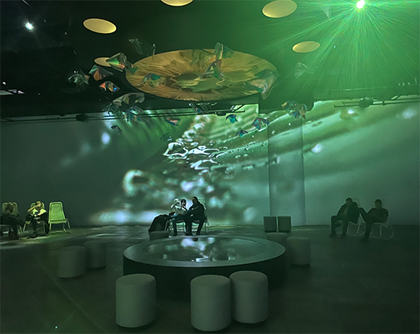
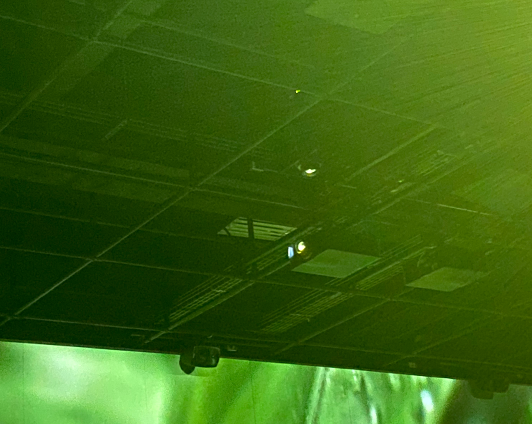
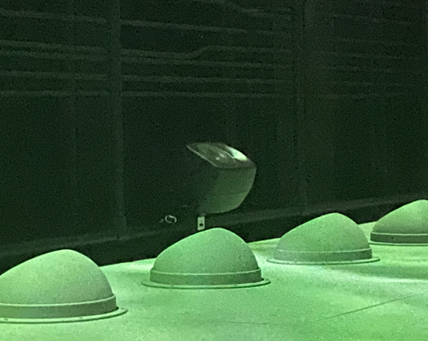
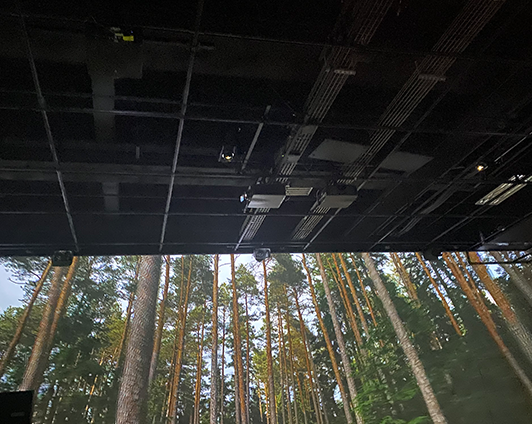
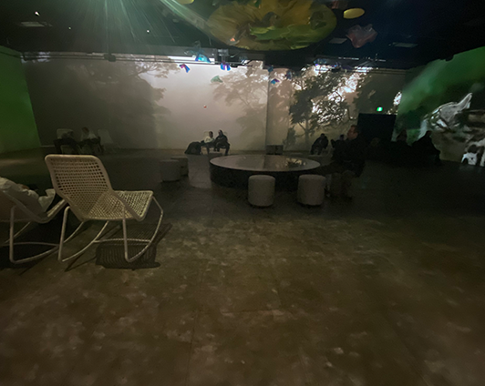
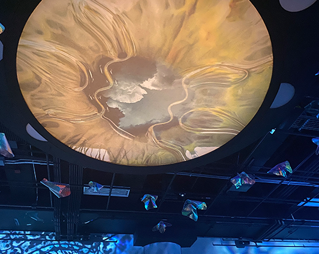

# Nature Vive
## Oasis Immersion

> Le programme propose une expérience sensorielle en pleine nature, présentée comme jamais auparavant, dans une mise en scène conçue pour inciter les visiteurs à agir positivement face aux grands enjeux de la biodiversité. Nature Vive se veut un moment suspendu dans le temps, offrant un spectacle émouvant qui nous rappelle l'importance de préserver la magie de notre chère planète. https://oasis.im/en/root-for-nature/ (traduit de l'anglais au français)

*Vidéo par Sara Pop*

## Mise en espace

Nature Vive est situé dans une grande pièce avec quatre murs blancs, propices à la projection d'images. Au milieu de la pièce, au plafond, il y a un rond qui change de couleur en fonction de ce qui est projeté sur les murs. Il y a plusieurs chaises berçantes dans la pièce, ainsi que des petits tambourins.

## La projection

C'est une projection d’environ 20 minutes qui montre une multitude d'animaux dans leur habitat naturel. Les animaux sont grands sur les murs, donnant un sentiment d'infériorité au spectateur. Les images sont vibrantes et claires, plongeant les gens dans l'univers animal.

## Composantes et mise en exposition
### Projecteurs
Premièrement, il y avait évidemment des projecteurs. Il y en avait cinq : un pour chaque mur, ainsi qu'un qui était pointé vers le sol.

Dans la photo, il est possible de les distinguer grâce à leur rond blanc lumineux.  
### Hauts-parleurs
À travers la pièce, il y avait plusieurs hauts-parleurs éparpillés. J'ai pu en compter neuf. Ils étaient placés par rangées de trois.

Au plafond, on peut voir deux projecteurs dos à dos ainsi que trois hauts-parleurs alignés sur le mur.

### Bancs

Il y avait une douzaine de chaises berçantes, des tambourins et deux bancs pour pouvoir s'installer confortablement et plonger dans les projections.

### Décorations

Au plafond, au centre de la pièce, il y a ce rond lumineux. Le motif dessus ressemble à un motif de planète. La couleur de ce rond change en fonction des nuances de la projection. Autour de ce cercle, il y a de petits bouts de miroirs qui pendent du plafond. La lumière se reflète sur les miroirs et crée un effet magique.

## Conclusion

Cette exposition a été une des plus belles que j'ai visitées cette année. C'était un endroit très calme et serein. Ça montre aussi que même si une exposition a moins de composantes, il est quand même possible de créer quelque chose d'incroyable. Les images étaient magnifiques et attendrissantes. Le but de cette installation était de rendre le monde conscient des enjeux que la faune subit à cause du changement climatique et des gens ignorants qui ne la respectent pas. Je pense que le message est bien passé, c’est certain.
