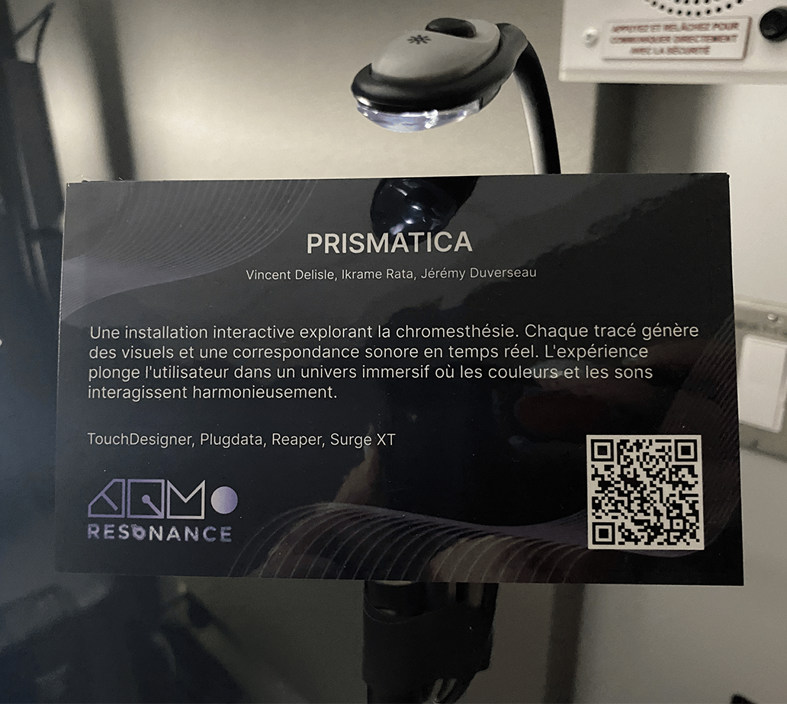
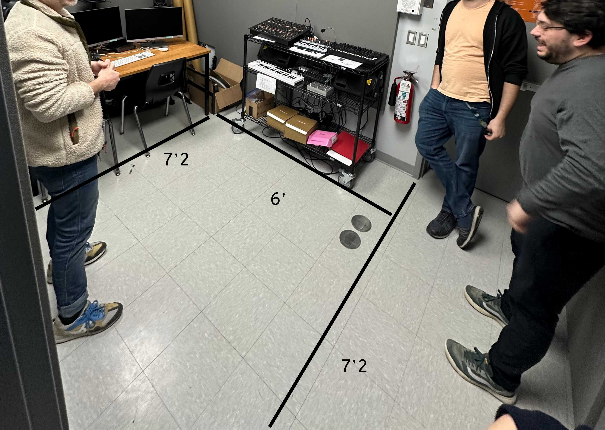
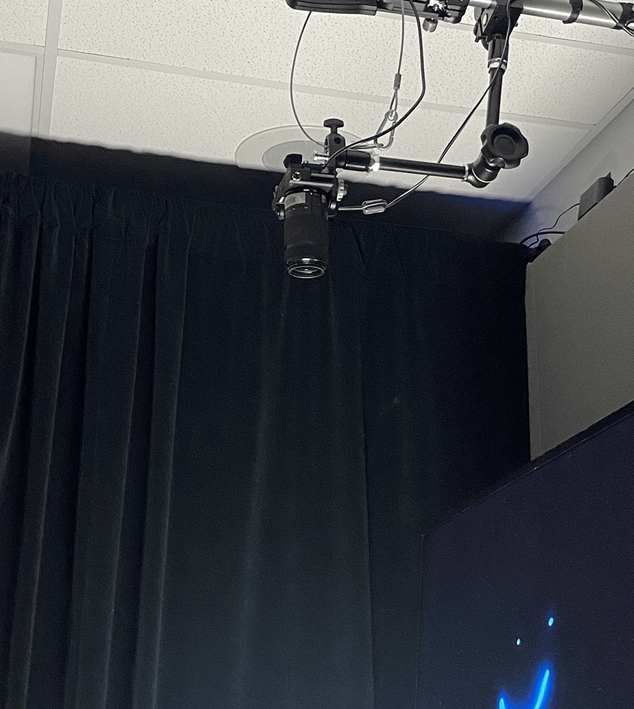
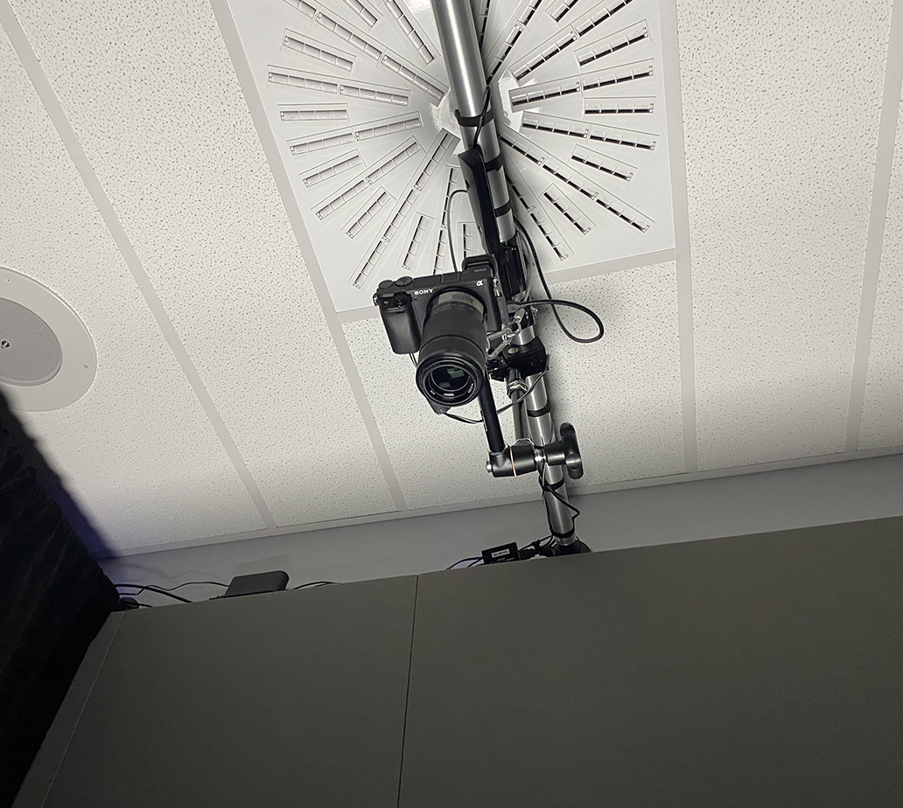
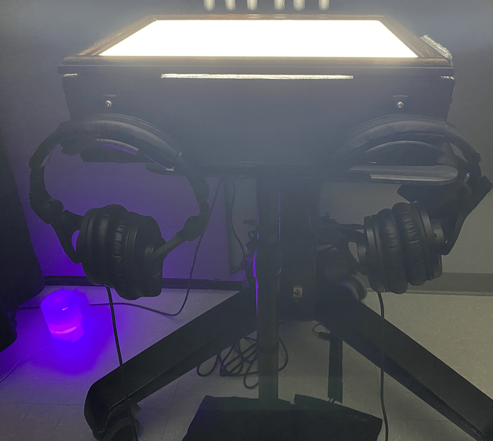
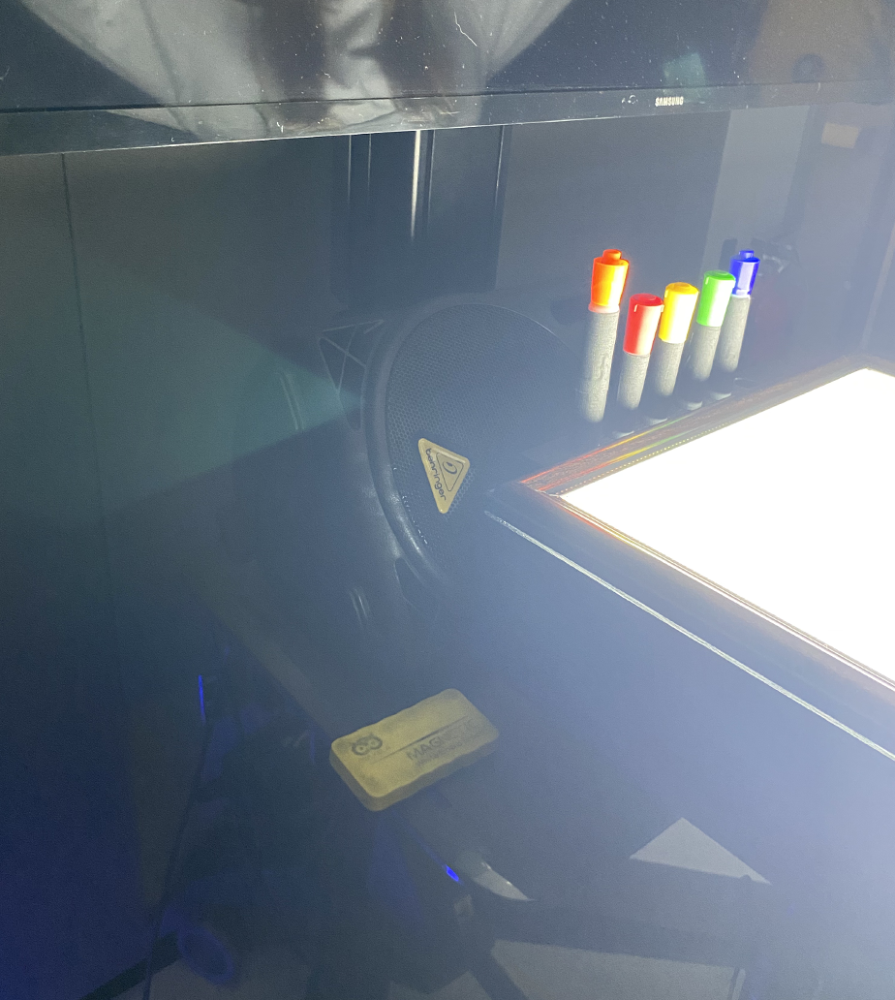
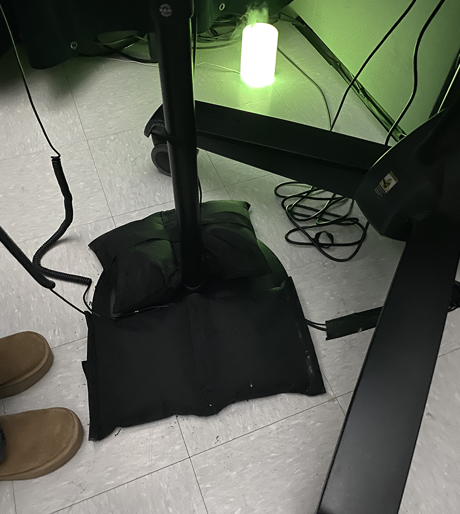
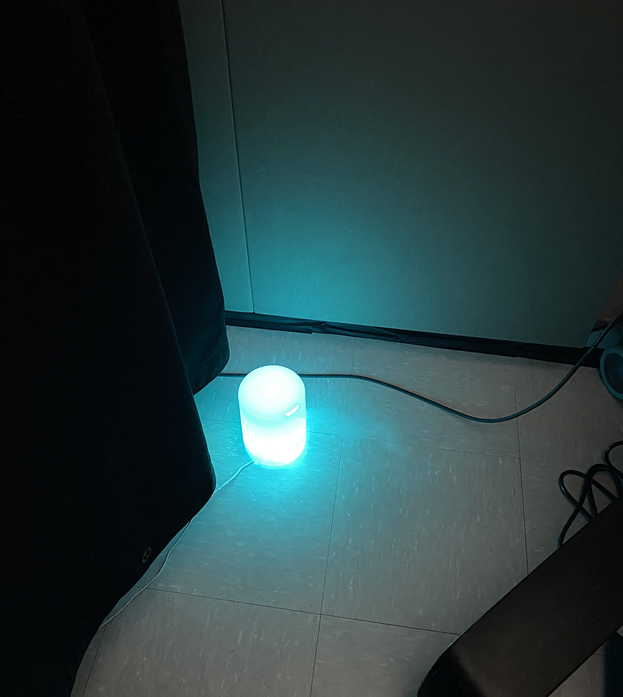

# Prismatica

*Image tirée du [Github de Prismatica](https://pootpookies.github.io/Prismatica/#/)*.

Par Ikrame Rata, Jérémy Duverseau et Vincent Delisle.

Prismatica est un dispositif créé par une équipe d'étudiants dans le programme de technique d'intégration art et multimédia pour l'exposition intitulée *Résonance*. Le projet a été produit sur plusieurs mois à l'aide de divers notions apprises durant leur parcours. J'ai eue la chance de le visiter le 25 février 2025, lorsqu'il était encore en conception et le 18 mars 2025, lors de sa présentation finale.

###### Notre installation interactive, Prismatica, repose sur la chromesthésie, une forme de synesthésie où les sons sont perçus en fonction des couleurs. Grâce à une caméra connectée à TouchDesigner, nous analysons en temps réel un tableau blanc sur lequel l’utilisateur dessine avec des marqueurs colorés. Chaque couleur utilisée génère une mélodie spécifique, basée sur le cercle chromatique de Newton, transformant l’acte de dessiner en une expérience multisensorielle où le son et l’image fusionnent.

*Tiré du [Github de Prismatica](https://pootpookies.github.io/Prismatica/#/)*

## Mise en espace

Le dispositif est situé dans le petit studio à Montmorency.

## Les composantes

Afin de créer une expérience multimédia, l'équipe de Prismatica à dû utiliser plusieurs composantes.

### Une caméra

Elle est placée au dessus du dispositif, afin qu'elle puisse suivre les mouvements de l'utilisateur.

 

### Des écouteurs

Une des parties les plus importantes à Prismatica est bien sur, les sons produits par chaque trait de crayon. Pour que le son soit 
clair et immersif, les écouteurs sont cruciaux. Il y a deux paires afin que deux utilisateurs puissent intéragir en même temps.

### Un haut-parleur

Marlgé les écouteurs, le son peut quand même être entendu par ceux qui n'ont pas les écouteurs. Il est placé discrètement sous l'écran et derrière le tableau blanc.

### Un tableau blanc effacable

Pour que plusieurs utilisateurs puissent utiliser le dispositif un après l'autre et pour que le canva soit frais à chaque utilisation,
l'équipe à opté pour un tableau blanc effaçable. C'est rapide et efficace!

### Un écran et des crayons

Pour que la projection soit claire, les traits de crayons sont visibles sur un écran positionné devant l'utilisateur. Ensuite, il faut évidement 
des crayons pour pouvoir dessiner sur le tableau blanc. Ils sont positionnés à la disposition de l'utilisateur, devant soi.

### Des sacs de sable

Afin de tenir la structure qui tient le tableau stable, l'équipe a utilisé des sacs de sable pour bien le stabiliser.

### Un diffuseur

L'équipe à ajouté un diffuseur pour rendre l'expérience véritablement immersive, en apportant l'utilisateur dans sa bulle
grâce au sens de l'odorat, le toucher et la vue.

