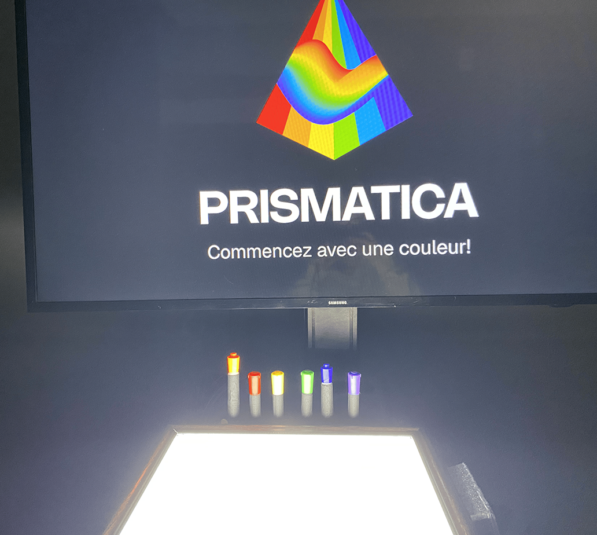

# Prismatica

*Image tirée du [Github de Prismatica](https://pootpookies.github.io/Prismatica/#/)*

Prismatica est un dispositif créé par une équipe d'étudiants dans le programme de technique d'intégration art et multimédia. Le porjet a été produit
sur plusieurs mois à l'aide de divers notions apprises durant leur parcours.

###### Notre installation interactive, Prismatica, repose sur la chromesthésie, une forme de synesthésie où les sons sont perçus en fonction des couleurs. Grâce à une caméra connectée à TouchDesigner, nous analysons en temps réel un tableau blanc sur lequel l’utilisateur dessine avec des marqueurs colorés. Chaque couleur utilisée génère une mélodie spécifique, basée sur le cercle chromatique de Newton, transformant l’acte de dessiner en une expérience multisensorielle où le son et l’image fusionnent.

*tiré du [Github de Prismatica](https://pootpookies.github.io/Prismatica/#/)*

## Les composantes

Afin de créer une expérience multimédia, l'équipe de Prismatica à dû utiliser plusieurs composantes.

**Une caméra qui suis les mouvements de l'utilisateur**

