# Les projets des finissants en TIM

## PRISMATICA
###### L'équipe de Jérémy Duverseau, Ikrame Rata et Vincent Delisle

*Photo prise par Sara Pop.*
https://pootpookies.github.io/Prismatica/#/10_equipe/

### Installation en cours
*Photos prisent par Sara Pop , lors de la première visite des projets. (25 Février 2025)*

### Schémas d'installation

 

###### Images tirés du [Github de Prismatica](https://pootpookies.github.io/Prismatica/#/10_equipe/)

### Sentiments évoqués

Lorsque j'ai appris le concept et l'idée derrière Prismatica, je me suis immédiatement sentie inspirée.
Je trouve que le jeu de couleurs est intéressant et différent, et ça ne s'arrête pas là - chaque trait et couleur crée son propre son.
Ça va au-delà du simple dessin, car avec Prismatica, tu utilises 4 sens au lieu de 2 avec le dessin traditionnel.

### Cours incontournables

D'après moi, les cours d'Audio (1 et 2), Traitement audiovisuel ainsi qu'Objets interactifs sont importants
pour la conception d'un projet comme Prismatica.

### Technique inconnue

Afin que les traits de dessin soient reconnus et projetés sur l'écran, l'équipe a utilisé une caméra connectée
à un logiciel nommé TouchDesigner.

***<<TouchDesigner est un langage de programmation visuelle basé sur des nœuds pour le contenu multimédia interactif en temps réel. Développé par l'entreprise torontoise « Derivative », il est fréquemment utilisé par les artistes, les programmeurs, les codeurs créatifs, les concepteurs de logiciels et les performeurs pour créer des performances, des installations et des œuvres multimédias fixes.>>***
###### *https://en.wikipedia.org/wiki/TouchDesigner*

Voici comment l'équipe à décrit le processus sur leur [Github ](https://pootpookies.github.io/Prismatica/#/30_production/50_technologies/)

***<<Algorithmes de détection :***
***Ces algorithmes permettent de détecter les dessins en temps réel et de générer des événements en fonction des formes et couleurs dessinées sur le tableau blanc.***

***Détection de forme et de couleur :
TouchDesigner analyse les images captées par la caméra pour reconnaître les formes et couleurs utilisées. Ces informations sont ensuite traduites en effets visuels et déclenchements sonores.***

***Médias génératifs :
TouchDesigner permet de générer du contenu visuel en temps réel, créant une expérience interactive et immersive unique pour chaque utilisateur.***

***Vidéo interactive :
Les dessins sont projetés sous forme de compositions visuelles dynamiques, et l’environnement réagit en fonction de l’évolution du dessin.***

***Ambiances sonores préenregistrées :
Plutôt que d’être générés en temps réel, les sons sont sélectionnés et déclenchés selon les dessins détectés par TouchDesigner, assurant une cohérence entre l’image et l’audio.>>***

###### *Tiré du [Github de Prismatica](https://pootpookies.github.io/Prismatica/#/30_production/50_technologies/)*

## LUMINATURA
###### L'équipe de Audrey Dandurand, Camilia Bouatmani, Ihab Mouhajer, Justine Rousseau et Prethiah Rajaratnam.
### Installation finale

*Photo prise par Sara Pop.*

### Schémas d'installation

 
###### Images tirés du [Github de Luminatura](https://miaou-mafia.github.io/projet-luminatura/#/10_equipe/)

### Sentiments évoqués

Ma première réaction en voyant l'installation a été « wow ». Les fleurs suspendues ont capté mon attention et je suis restée fixée dessus pendant un moment.
Après avoir touché la plaque, j'ai été encore plus impressionnée. Les projections sont élégantes et colorées et se fondent entre elles. Les fleurs deviennent encore plus magnifiques lorsqu'on touche la plaque. J'ai trouvé intéressant la façon dont la plaque utilisait l'électricité générée par notre corps afin d'interagir avec les projections.

### Cours incontournables

D'après moi, le cours de Réalité mixte, Objets interactifs ainsi qu'Installation multimédia sont importants pour la conception 
d'un projet comme Luminatura.

## ETHERIA
###### L'équipe de Joshua Gonzalez-Barrera, Victor Gileau, Michael Un Dupré, Pierre-Luc Proulx et Maik Hamel.

### Installation finale

*Photo prise par Sara Pop.*

### Schéma d'installation

###### Image tiré du [Github de Etheria](https://ethereal-creators.github.io/Etheria/#/30_production/60_plantation/)

### Sentiments évoqués

Ce projet m'a paru impressionnant ! Je ne m'attendais pas à ce qu'un étudiant de 3e année puisse créer un tel projet avec les matières enseignées
dans le programme TIM. Je me suis bien amusée à jouer au jeu avec mes amis et nous étions tous excités par l'idée de pouvoir créer un projet semblable
un jour.

### Cours icontournables

D'après moi, Les deux cours de programmation ( Programmation Interactive et Intéractivité Ludique) ainsi qu'Objets Interactifs sont importants pour la conception d'un
projet comme Etheria.

## INTERNATURE

###### L'équipe de Khaly Tia Sing, Isaac Fafard, Delphine Grenier, Sitmonternna Yi et Kenza El Harrif.
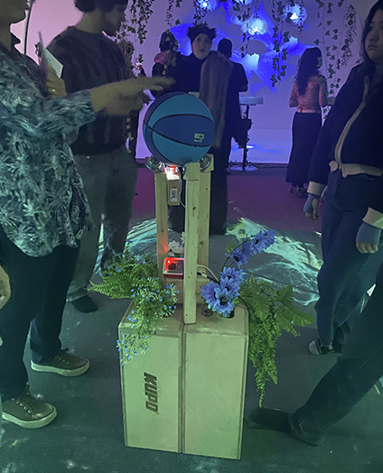
*Photo prise par Sara Pop.*
### Installation finale 

*Photo prise par Sara Pop*

### Schémas d'installation

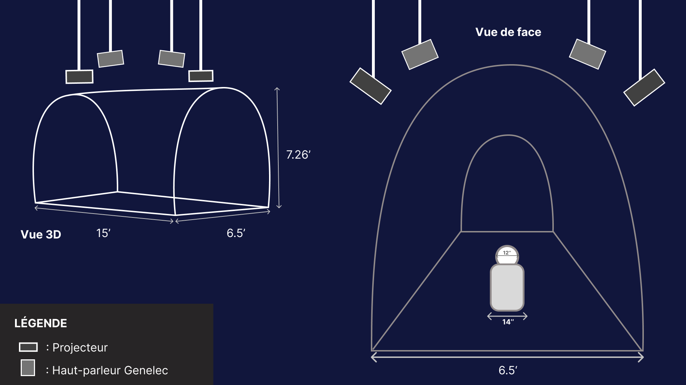 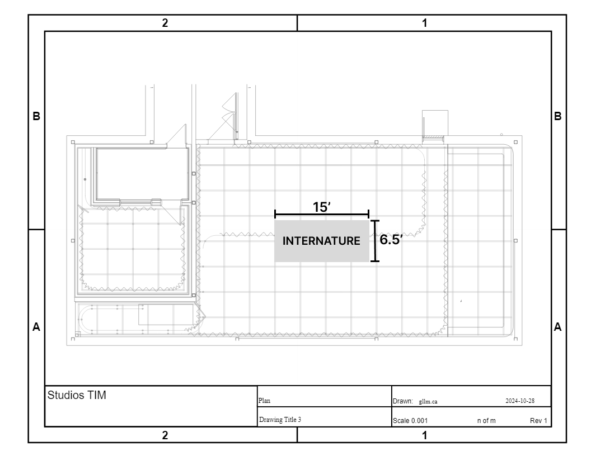
###### Images tirés du [Github de Internature](https://tprangers.github.io/internature/#/30_production/60_plantation/)

### Sentiments évoqués 

J'ai trouvé que le message derrière était intéressant et bien transmis. Nous étions les maîtres de la sphère et chaque mouvement
qu'on faisait avait un impact sur les projections sur la serre. J'ai trouvé que c'était bien fait et très immersif. C'était joli et amusant !

### Cours incontournables

D'après moi, le cours d'Audiovisuel, Objets Interactifs ainsi que Modélisation 3D sont de cours importants
pour la conception d'un projet comme Internature.

## FUGA

###### L'équpe de Abdel Ali Djeral, Daniel Dezemma, Matis Labelle, Tristan Khadka et Yavuz-Selim Gucluer.

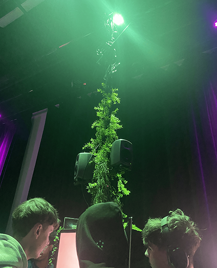
*Photo prise par Sara Pop.*

### Installation finale

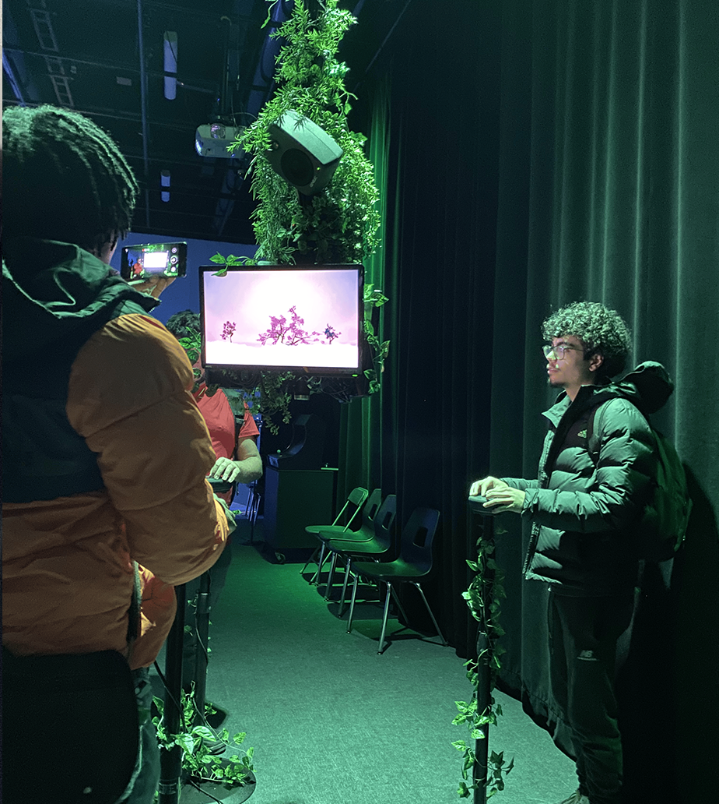
*Photo prise par Sara Pop.*

### Schémas d'installation

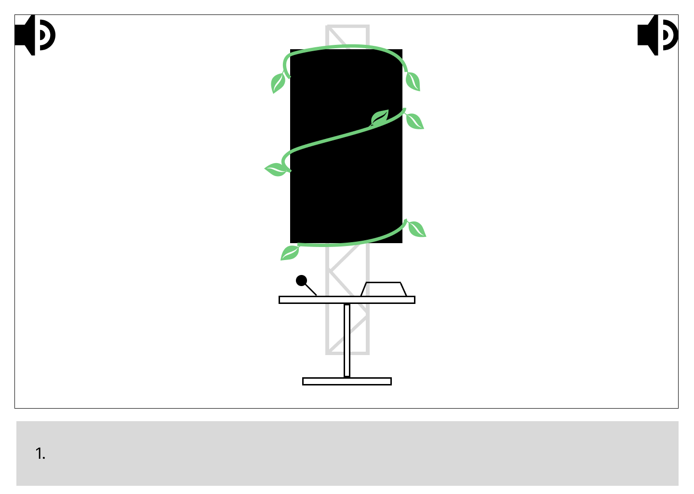 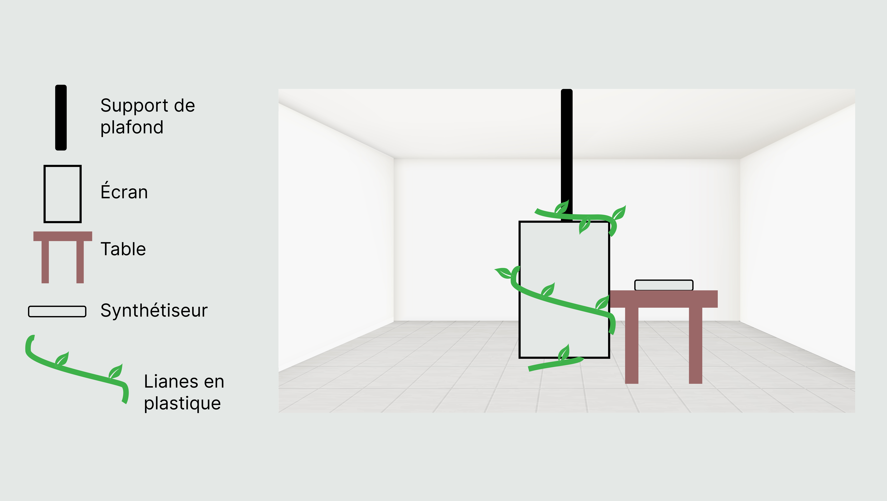
###### Images tirés du [Github de Fuga](https://escapism-fuga.github.io/Fuga/#/30_production/60_plantation/)

### Sentiments évoqués

J'ai trouvé que la manière dont le projet a été décoré et placé etait bien dans le thème et c'était jolie.
Je me suis amusé a créer différente combinaisons avec les synthétiseurs. C'est vraiment un beau projet, mais j'aurais aimé qu'il y 
ait un petit quelque chose de plus comme par exemple, un jeu intégré ou des saisons. Je dis ça parce que je suis passée a travers les combinaison
en moins de 1 minute et ensuite j'ai continué mon chemain. J'aurai aimé que l'expérience dure un peu plus.

### Cours incontournables
D'après moi, Les deux cours de programmation ( Programmation Interactive et Intéractivité Ludique) ainsi que Modélisation 3D sont importants pour la conception d'un
projet comme Fuga.

## CON DU8

###### L'équipe de Alexandre Gervais, Ian Corbin, Jérémy Roy-Coté, Keven Malric et Samuel Desmeules-Voyer.
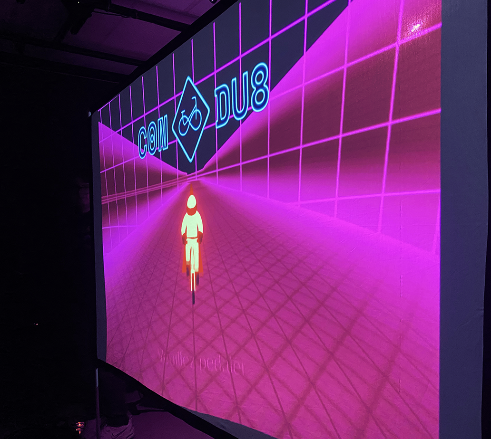
*Photo prise par Sara Pop.*

### Installation finale

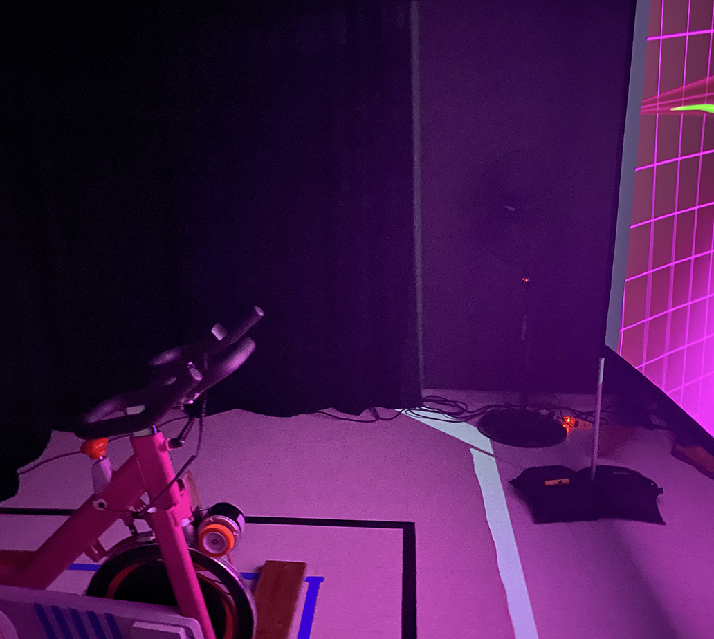
*Photo prise par Sara Pop.*

### Schémas d'installation

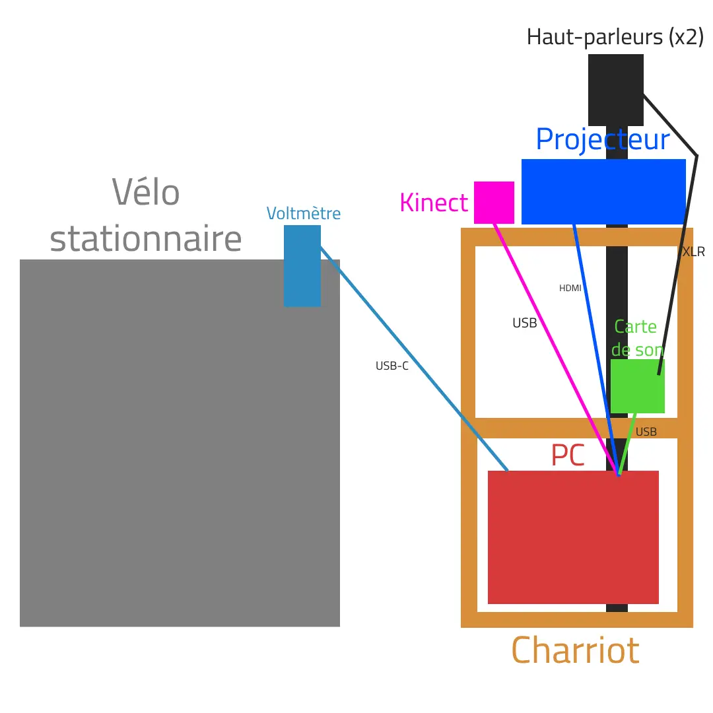
###### Images tirés du [Github de Condu8](https://gearshift-games.github.io/Web-C0N-DU8/#/30_production/60_plantation/)

### Sentiments évoqués

Le projet est amusant puisque qu'il faut vraiment utiliser son corps en entier pour intéragir avec, contrairement aux autres projets où
nous utlisions seulement nos mains. Je pense que c'est un concept original et qui peut plaire à tout le monde!

### Cours incontournables

D'après moi, Les deux cours de programmation ( Programmation Interactive et Intéractivité Ludique) ainsi que Objets intéractifs sont importants pour la conception d'un projet comme CON DU8.

## Arcadia
###### L'équipe de Anton Nikulin, Dominic Yale et William Beauvais

*Image tirée du [Github de Arcadia](https://cousi-cousa.github.io/Arcadia/#/).*

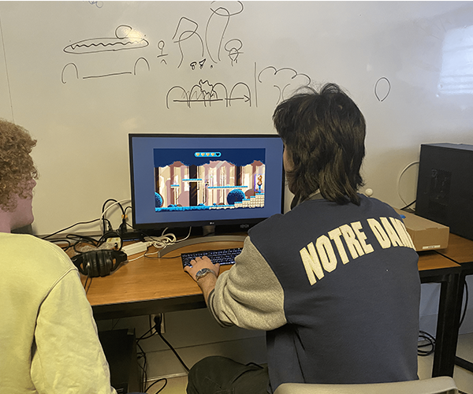

*Photo prise par Sara Pop , lors de la première visite des projets. (25 Février 2025)*

### Schéma d'installation

Aucune Plantation n'a été mise sur le [Github de Arcadia](https://cousi-cousa.github.io/Arcadia/#/30_production/60_plantation/).
Il est spécifié que le projet se retrouve près de l'entrée du grand studio.

### Sentiments évoqués

J'ai eu le chance de voir ce projet une seule foit, lorsqu'il était encore ne dévéloppement. Il ne m'a pas nécéssairement attiré, puisqu'il se présente en étant seulement un jeu d'arcade et personellement, ce n'est pas pour moi. Par contre, j'ai quand même été impréssionée par le style artistique ainsi que l'installation finale.

### Cours incontournables

D'après moi, Les deux cours de programmation ( Programmation Interactive et Intéractivité Ludique) ainsi que Installation multimédia sont importants pour la conception d'un
projet comme Arcadia.

