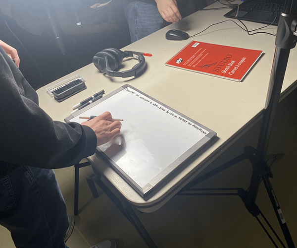
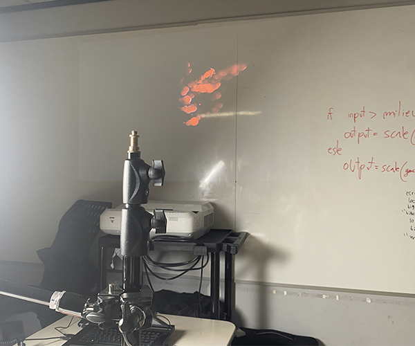
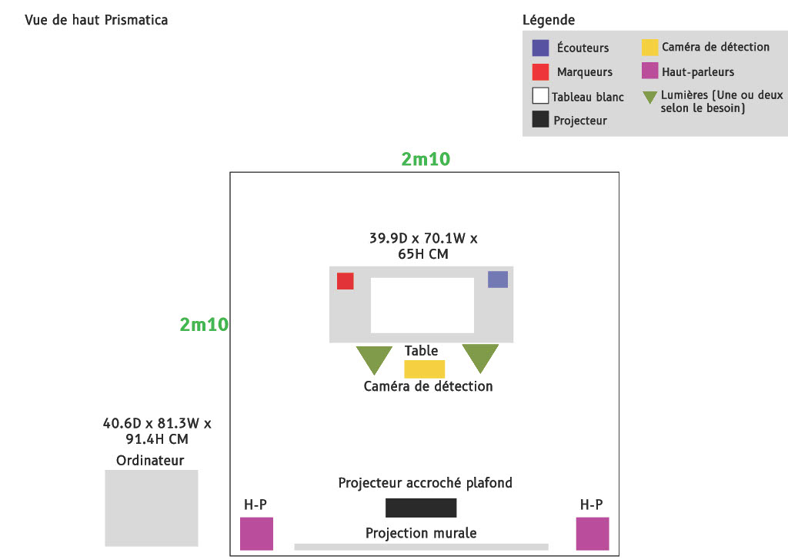
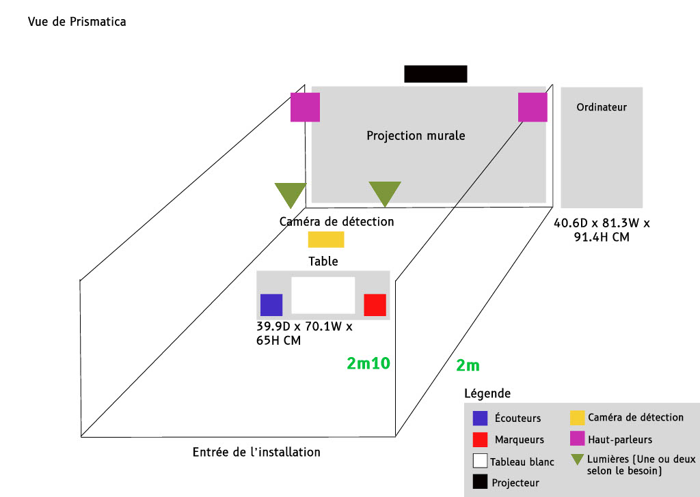
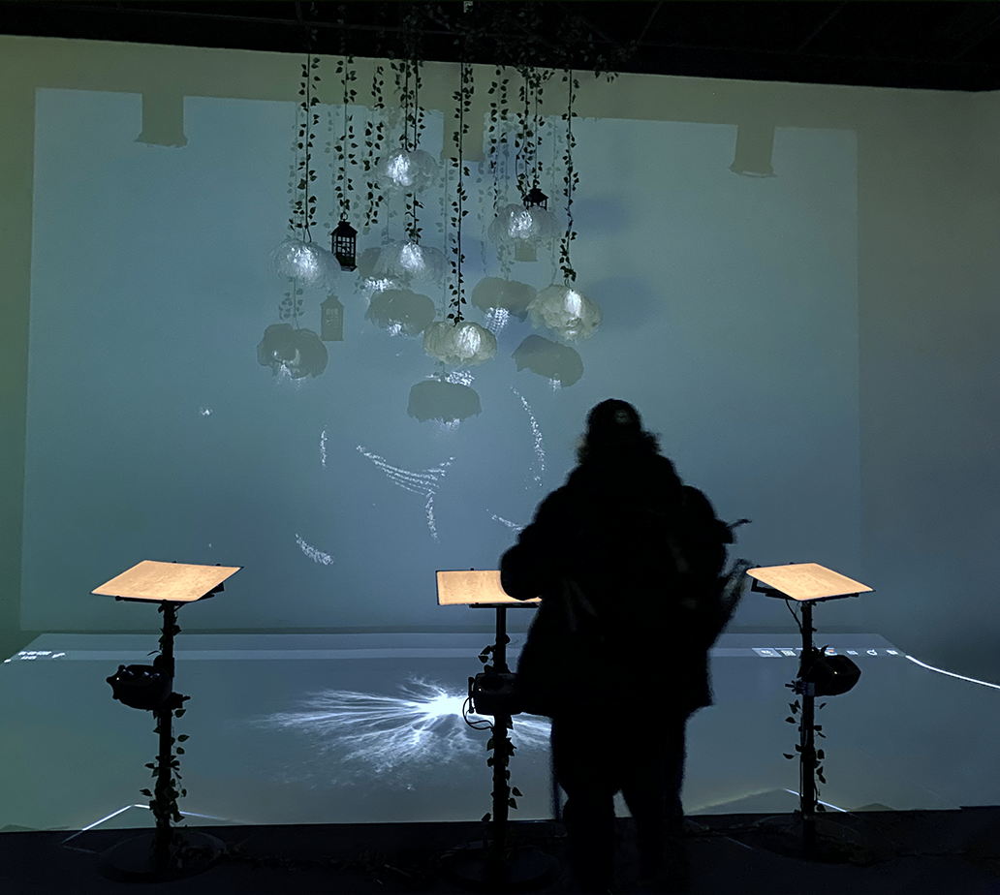
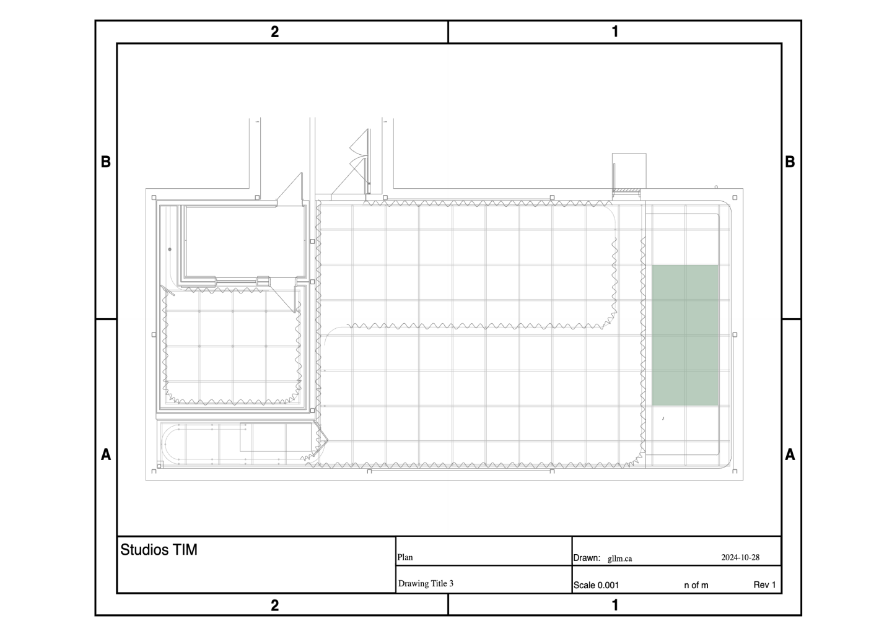
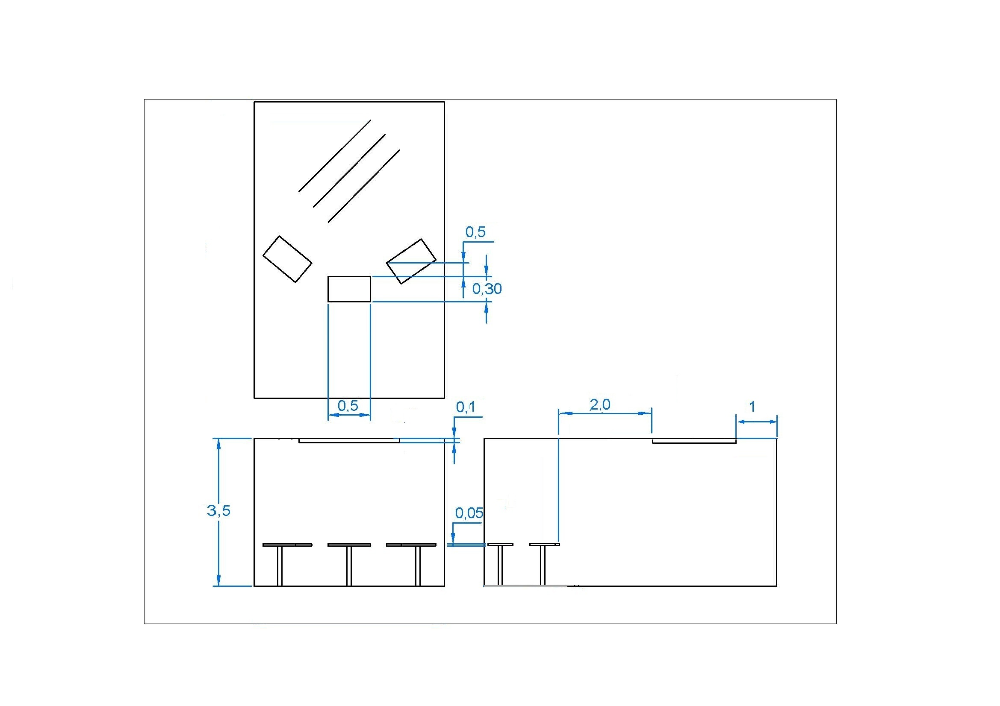
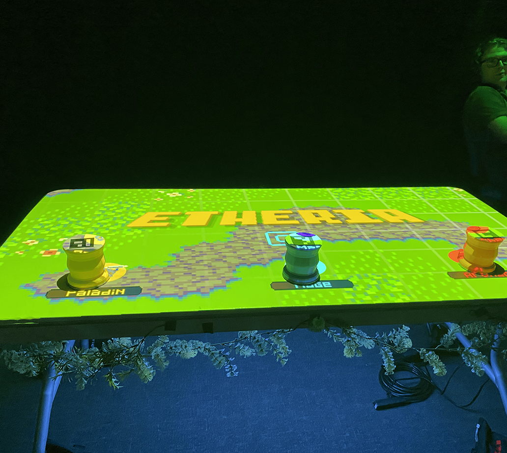
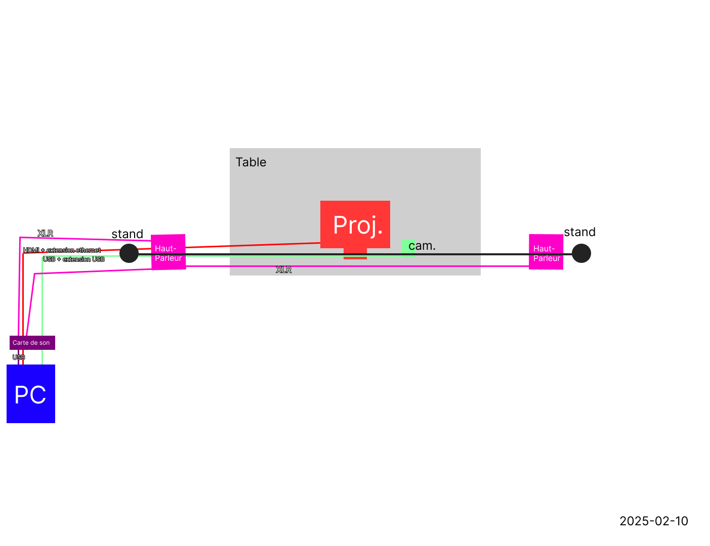
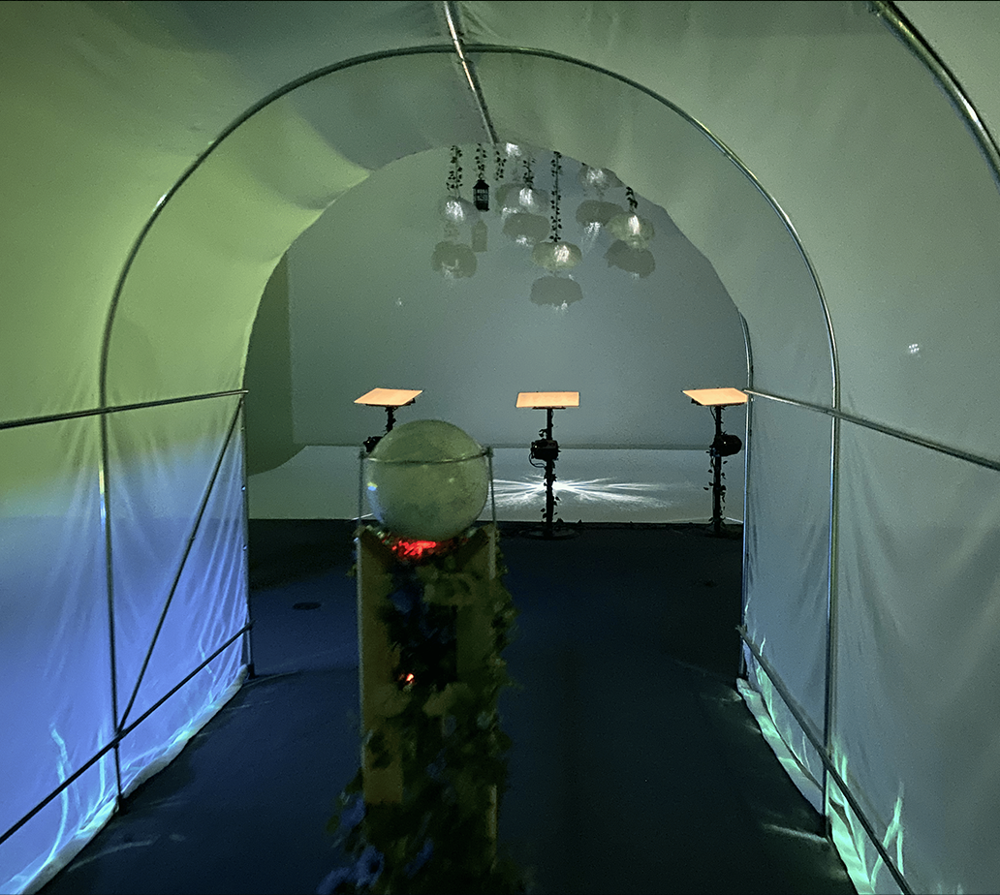

# Les projets des finissants en TIM

## Prismatica
###### L'équipe de Jérémy Duverseau, Ikrame Rata et Vincent Delisle

*Photo prise par Sara Pop.*
https://pootpookies.github.io/Prismatica/#/10_equipe/

### Installation en cours
*Photos prisent par Sara Pop , lors de la première visite des projets. (25 Février 2025)*

### Schémas d'installation

 

###### Images tirés du [Github de Prismatica](https://pootpookies.github.io/Prismatica/#/10_equipe/)

### Sentiments évoqués

Lorsque j'ai appris le concept et l'idée derrière Prismatica, je me suis immédiatement senti inspirée.
Je trouve que le jeu de couleur est intéressant et différent, et ça ne s'arrête pas là - chaque trait et couleur créer son propre son.
Ça va au-delà de seulement le dessin parce que avec Prismatica, tu utilise 4 sens, au lieu de 2 avec le dessin traditionnel.

### Cours incontournables

D'après moi, les cours d'Audio (1 et 2), Traitement audiovisuel ainsi qu'Objets interactifs sont importants
pour la conception d'un projet comme Prismatica.

### Technique inconnue

## Luminatura
###### L'équipe de Audrey Dandurand, Camilia Bouatmani, Ihab Mouhajer, Justine Rousseau et Prethiah Rajaratnam.
### Installation finale

*Photo prise par Sara Pop.*

### Schémas d'installation

 
###### Images tirés du [Github de Luminatura](https://miaou-mafia.github.io/projet-luminatura/#/10_equipe/)

### Sentiments évoqués

La première réaction qu j'ai eu quand j'ai vu l'installation a été «wow». Les fleurs qui pendent on capturé mon attention et je suis restée fixé dessus pendant un moment.
Après avoir touché la plaque, j'ai été encore plus impréssioné. Les projections sont élégantes et colorés et se fondent entrent elles. Les fleurs sont encore plus magnifique lorsqu'on
touche à la plaque.

### Cours incontournables

D'après moi, le cours de Réalité mixte, Objets interactifs ainsi qu'Installation multimédia sont importants pour la conception 
d'un projet comme Luminatura.

### Technique inconnue

## Etheria
###### L'équipe de Joshua Gonzalez-Barrera, Victor Gileau, Michael Un Dupré, Pierre-Luc Proulx et Maik Hamel.

### Installation finale

*Photo prise par Sara Pop.*

### Schéma d'installation

###### Image tiré du [Github de Etheria](https://ethereal-creators.github.io/Etheria/#/30_production/60_plantation/)

### Sentiments évoqués

Ce pojet m'a paru imprésionnant! Je ne m'attendais pas à ce qu'un étudiant de 3ème année puisse créer tel projet avec les matières enseignés 
dans le progrmme TIM. Je me suis bien amusé à jouer au jeu avec mes amis et nous étions tous excité par l'idée de pouvoir créer un projet pareil
un jour.

### Cours icontournables

D'après moi, Les deux cours de programmation ( Programmation Interactive et Intéractivité Ludique) ainsi qu'Objets Interactifs sont importants pour la conception d'un
projet comme Etheria.

### Technique inconnue

## Internature

###### L'équipe de Khaly Tia Sing, Isaac Fafard, Delphine Grenier, Sitmonternna Yi et Kenza El Harrif.

### Installation finale 

