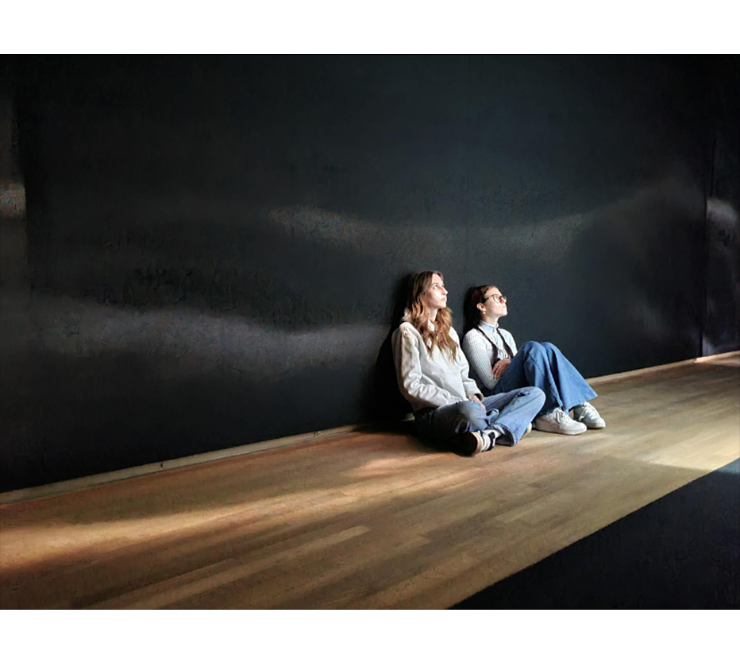
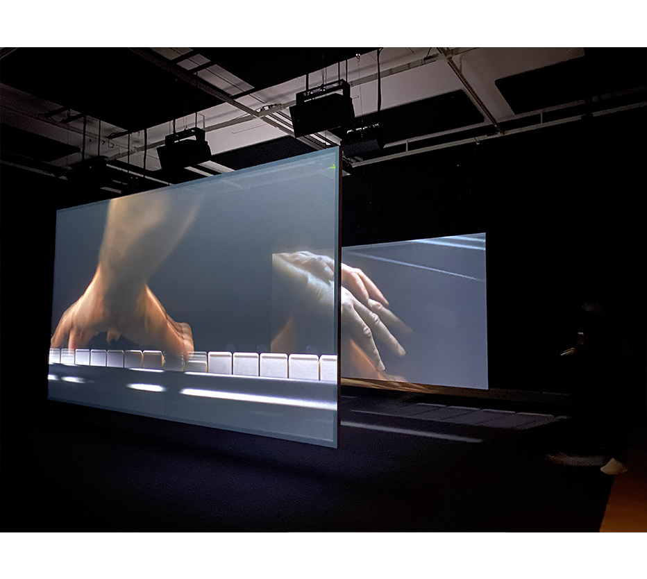
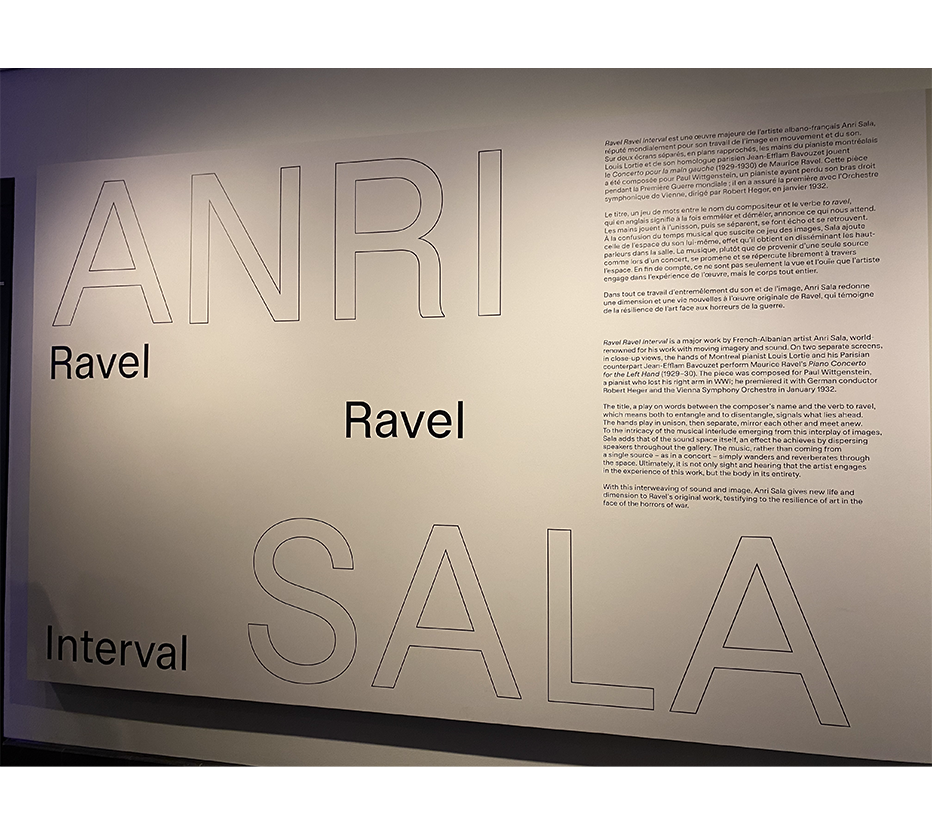
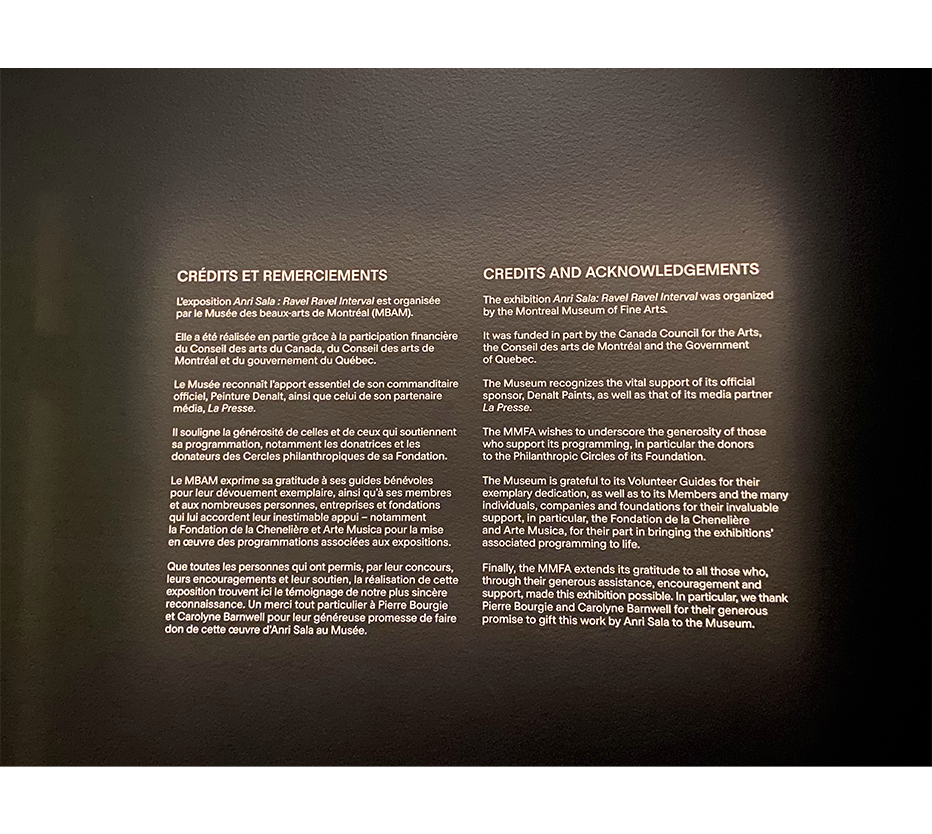
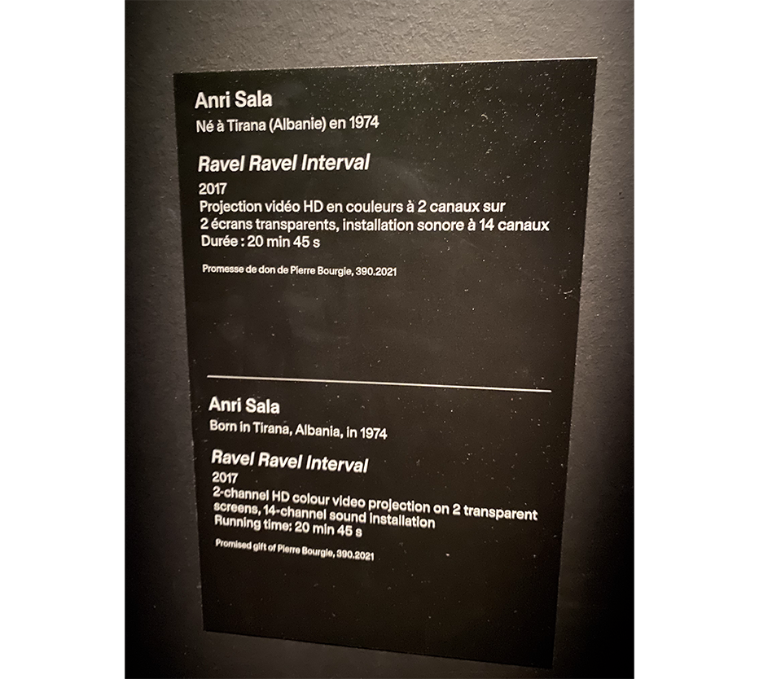
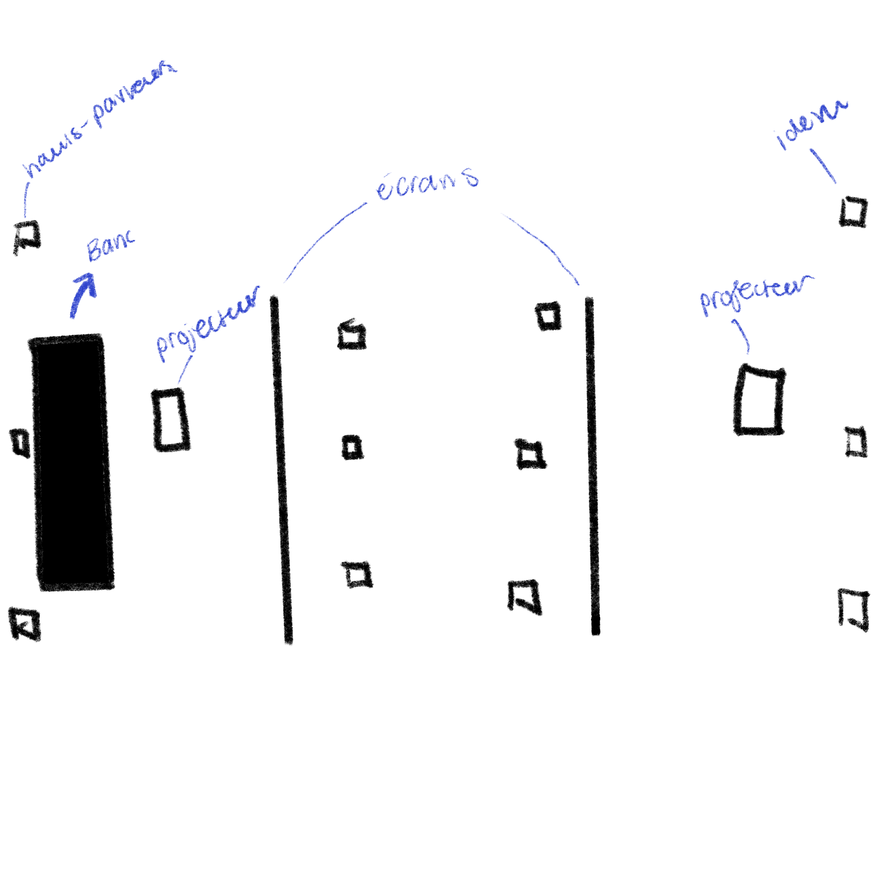
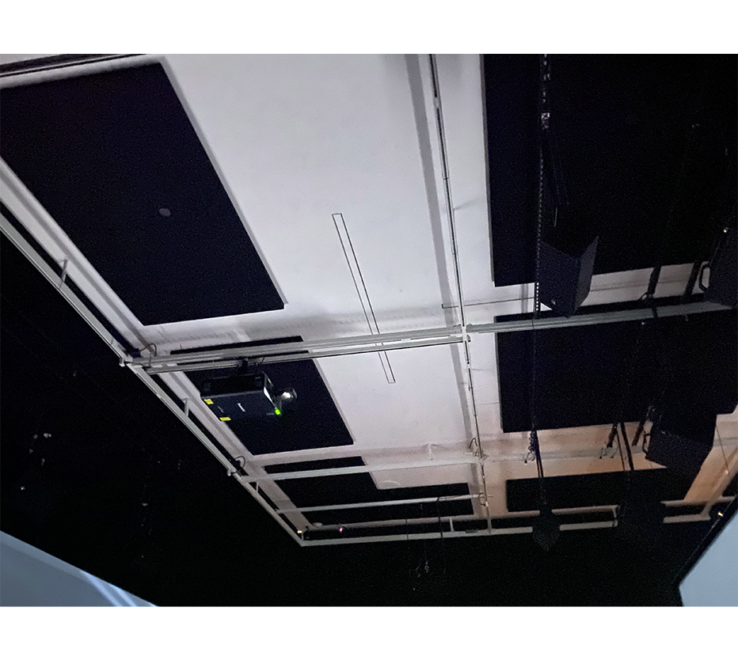
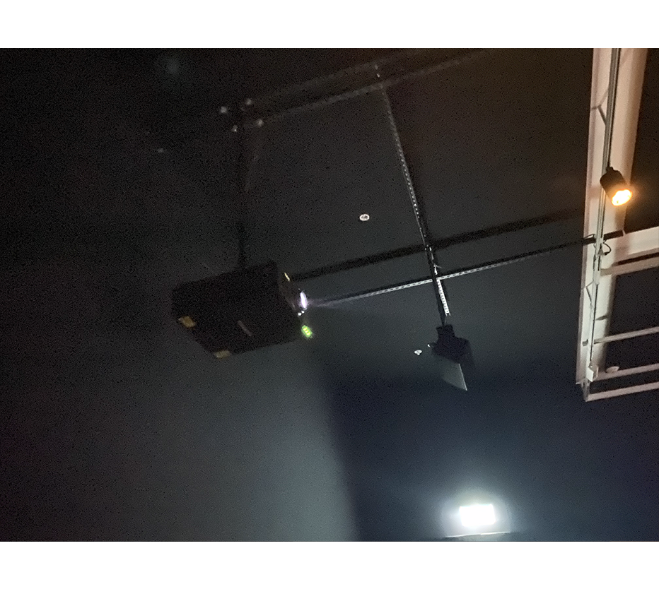
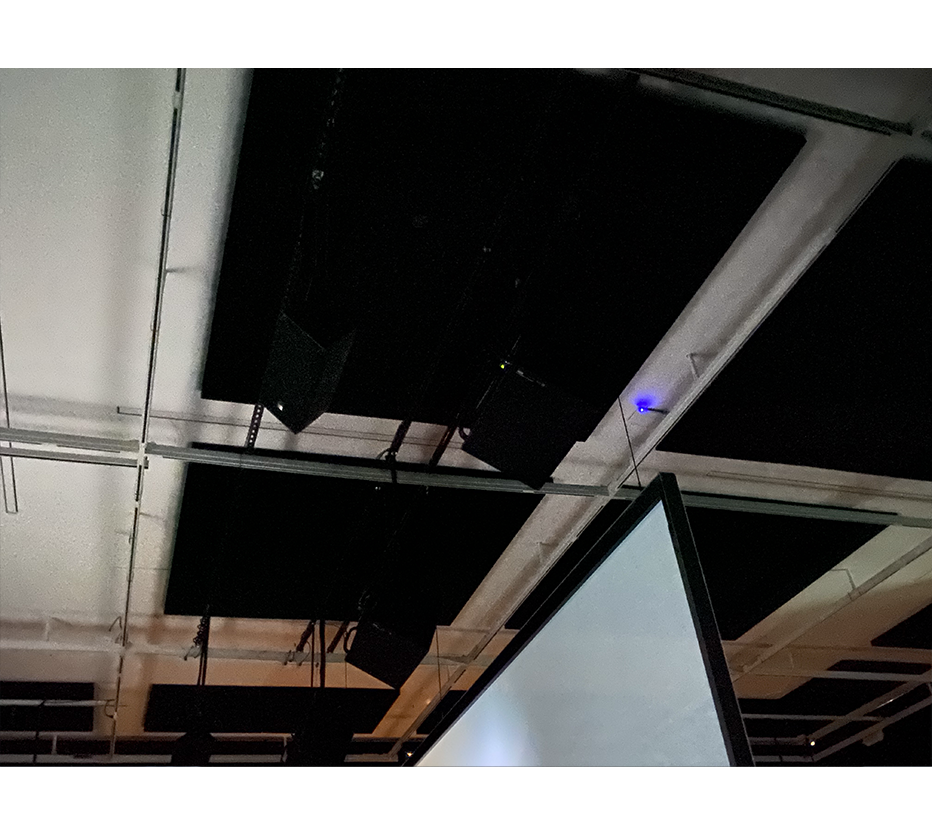
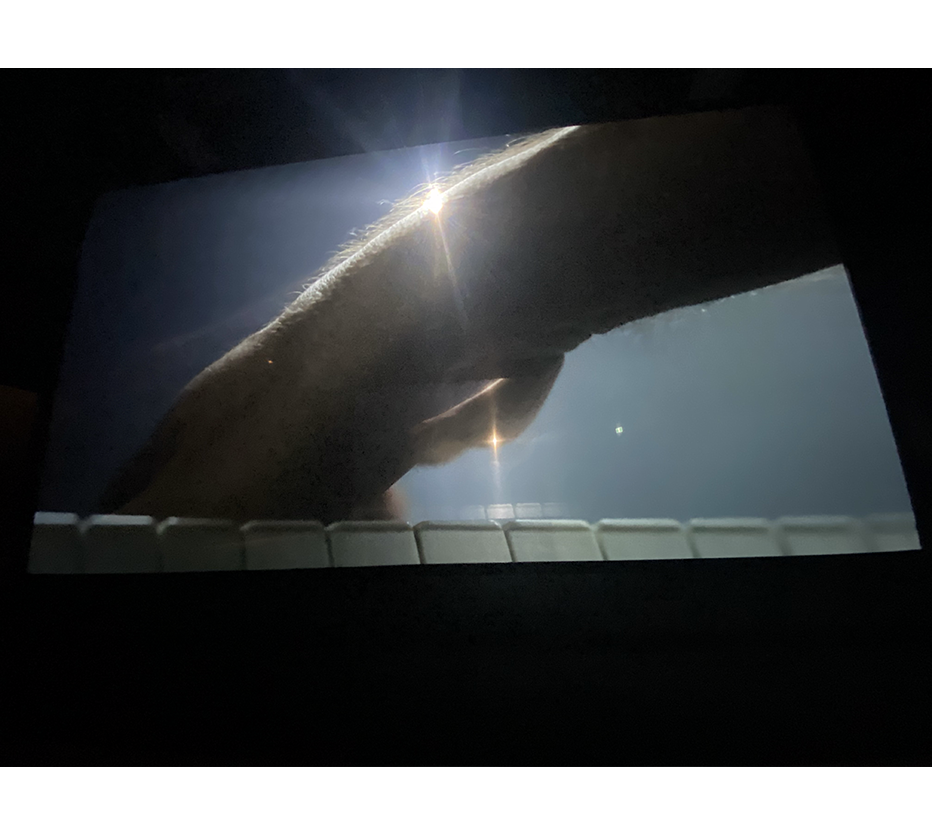

# Ravel Ravel Interval
###### Par Anri Sala

> L’intervalle, ou le décalage, entre ces deux interprétations met en lumière l’expression unique de la sensibilité humaine, nous invitant à accepter et à accueillir le flottement comme une composante essentielle de notre expérience artistique et personnelle. https://www.mbam.qc.ca/fr/expositions/anri-sala/

*Photo par Cédric Sirois-Tanguay*

## Mise en espace

*Photo par Sara Pop*

L'exposition est située dans une grande salle aux murs noirs. Le noir assombrit l'atmosphère de la pièce et dirige les yeux des spectateurs 
vers de grands tableaux transparents situés au centre de la pièce. Ce sont les seuls éléments visibles dans la pièce.

### Anri Sala

*Photo par Sara Pop*

L'entrée de la pièce est accompagnée d'un immense panneau qui présente Anri Sala, l'artiste, ainsi que l'histoire derrière l'œuvre (en anglais et en français).

*Photo par Sara Pop*
Cartel de remerciements.

### La pièce musicale
Dans cette expérience immersive, les deux écrans projettent l'image de la main gauche de deux pianistes qui jouent une composition de 20 minutes. Au début, les deux jouent le même verset de la pièce en même temps, mais au fil du temps, ils finissent par jouer deux parties différentes. Ils finissent par se synchroniser à nouveau à la fin de la pièce. La composition qu'ils jouent s'intitule *Concerto pour la main gauche*, et elle a été composée pour un pianiste qui a perdu son bras droit pendant la Première Guerre mondiale. Le son est particulier puisqu'il y a une multitude de hauts-parleurs cachés dans la salle. La musique enveloppe complètement les gens qui s'y trouvent. 

> Comme l’explique le commissaire, « Les mains droites sont également visibles dans certains plans, reposant sur les cuisses des pianistes. Alors que le tout dernier passage joué par les pianistes touche à sa fin, on voit les mains tomber, molles, apparemment sans vie ; ce ne sont pas les mains gauches, mais bien les droites, évoquant non seulement celles de Wittgenstein, mais aussi celles d’innombrables soldats, tombés au combat. »
Ravel Ravel Interval donne au public montréalais bien plus à méditer que la musique sublime à laquelle il assiste. L’installation parle de liberté artistique — un concept rarement associé à la musique classique — ainsi que de la capacité des artistes à surmonter des circonstances bouleversantes pour poursuivre leur art. Et, peut-être de manière encore plus pressante, elle nous pousse à réfléchir aux horreurs de la guerre à l’échelle mondiale. - Manu Sharma, [Stir World.](https://www.stirworld.com/see-features-ravel-ravel-interval-treats-audiences-to-a-layered-musical-experience) (traduit de l'anglais au français)

Donc, la pièce expose les horreurs de la guerre et ses conséquences sur la vie par la suite, spécifiquement pour les artistes.

## Composantes et mise en exposition
### Composantes

*Photo par Sara Pop*
 
À l'entrée, il y a un cartel qui énumère les composantes de l'œuvre.

*Photo par Sara Pop*

Ce projecteur est situé au fond de la salle, où il y a des bancs pour les gens. Sur la photo, il y a aussi trois haut-parleurs en rangée.

Ce projecteur est situé à l'entrée de la salle.

Il y avait des haut-parleurs alignés de cette façon au-dessus de chaque écran et le long de la pièce.

### Mise en exposition

**Fournis par l'artiste**
- L'enregistrement des mains et de la composition
- Les écrans transparents
- Les cartels de description

**Fournis par le Musée des beaux-arts de Montréal**
- Les projecteurs
- Les haut-parleurs
- Une pièce noire et insonorisée

## Expérience vécue

En écoutant la pièce, je me suis réellement fait transporter dans un autre monde. J'étais concentrée sur les écrans lumineux et la musique était enveloppante.  
J'ai trouvé ça joli quand on pouvait voir les deux mains sur un seul écran, chacune jouant une partie différente. Je trouve aussi que l'histoire derrière est touchante.  
Par contre, j'ai trouvé la composition vraiment longue. J’ai un peu honte de l’admettre, mais l’atmosphère m’a rendue somnolente à un moment donné.  
Bref, c'est une très belle exposition et je la recommanderais.

