# Le Banquet

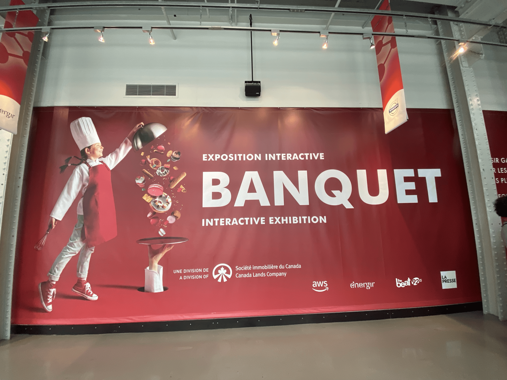 
> **Photo par Sara Pop**  
> *Embarquez pour une expérience multisensorielle et interactive autour d'un thème que tout le monde aime : la nourriture!
Voyagez à travers 5 scénarios audacieux et interactifs!
En commençant par la cuisine et en passant par la salle à manger, vous travaillerez la pâte, essayerez des combinaisons de goûts originales et explorerez les saveurs et les arômes.* https://banquetexhibition.com/

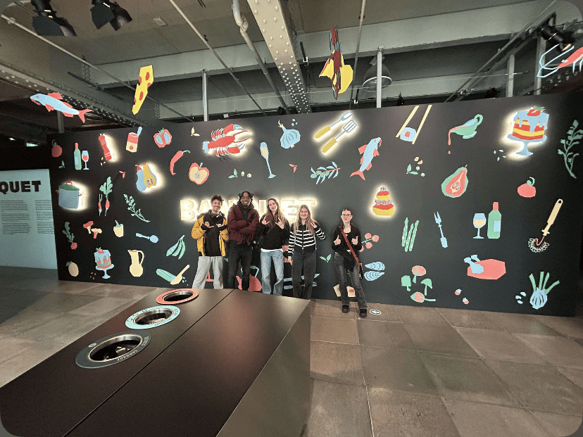

## **Les Plats Signatures**
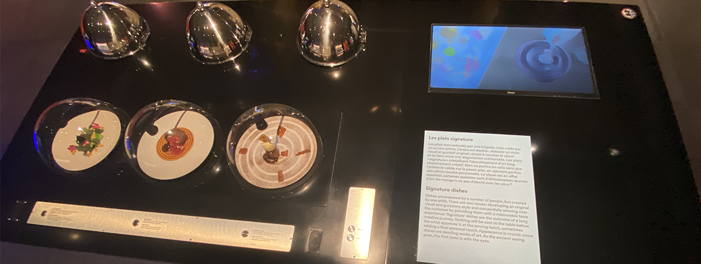 
[vidéo d'ensemble](https://youtu.be/jK2MxHlzELg)

> **Photo et vidéo par Sara Pop**  

*Par Cité des sciences et des l'industrie en partenariat avec Inrae.*  

Ce dispositif interactif met en avant l'importance de l'apparence d'un plat. Ces mets peuvent sembler banals, mais lorsqu'un artiste ajoute sa propre touche **personnelle et créative**, ils deviennent uniques et **reconnaissables**.
L'installation se compose d'une table noire et blanche, ornée de trois desserts acryliques sculptés sous une cloche en verre, ainsi que de trois autres cloches en métal qui s'ouvrent du côté opposé. Deux boutons permettent de lancer l'expérience interactive : en les activant, on déclenche des audios expliquant chaque étape du processus de création des desserts.  Chaque dessert est accompagné d'une plaquette précisant le nom du chef qui l'a conçu ainsi que ses ingrédients. Sous les cloches en métal, on découvre trois images d'œuvres réalisées par différents artistes, ainsi qu’un plat inspiré de ces œuvres. Enfin, il y a un petit écran qui diffuse des vidéos des chefs-cuisiniers composant leur oeuvreen pleine création

 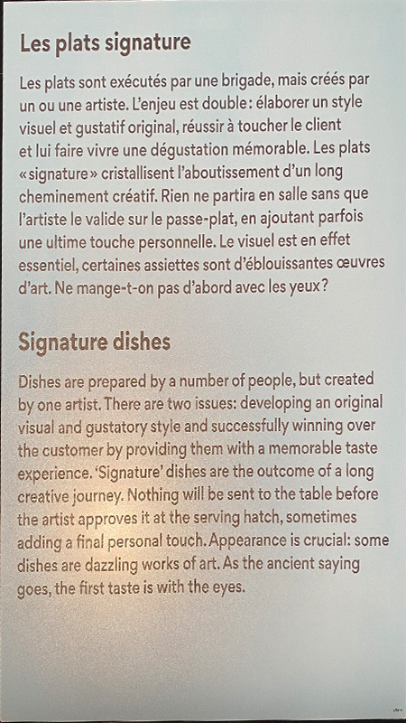
> **Photo par Sara Pop**  

L'intéractivité du dispositif en pleine action:
1. https://youtube.com/shorts/S1N97JyBPeM?feature=share 
2. https://youtube.com/shorts/qJVBQXrtq_E?feature=share
   > **Vidéos par Pablo Pereira Calderon**

## Mise en espace ##

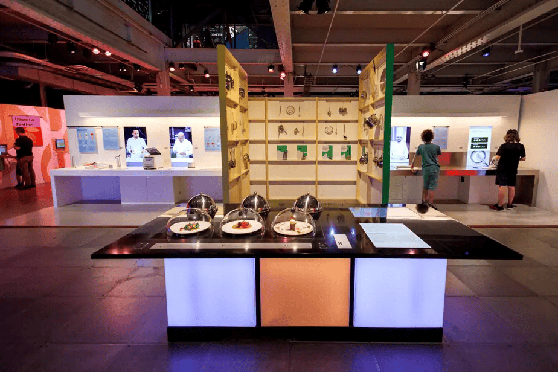
> **Photo par Alain Roberge, la Presse. https://www.lapresse.ca/gourmand/centre-des-sciences/gastronomie-science-et-plaisir/2024-06-30/banquet/interactivite-au-menu.php**

### Composantes et techniques ###
 #### Composantes fournies par l'artiste ####
 
-  Les faux desserts assemblés.
    - 
      > Par [Sebastien Bras](https://www.bras.fr/fr/la-cuisine/sebastien-bras)
    - 
     > Par [Mory Sacko](https://mory-sacko.com/chef/)
    - 
     > Par [Anne-Sophie Pic](https://anne-sophie-pic.com/portrait/)

     
- Les plaquettes gravées.
  
  - 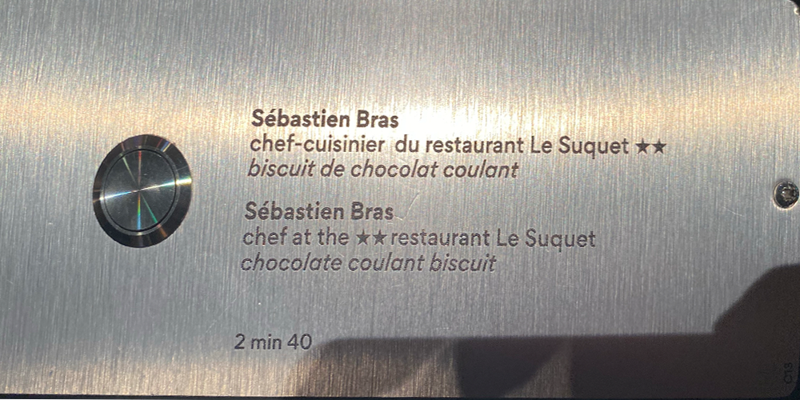
  
  - 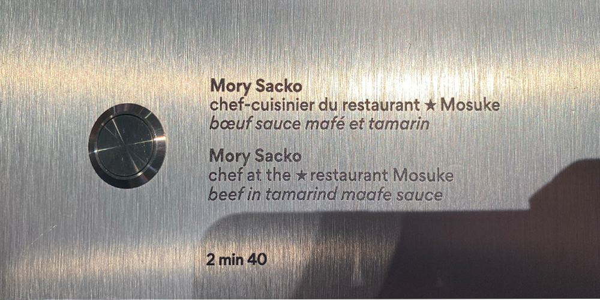
  
  - 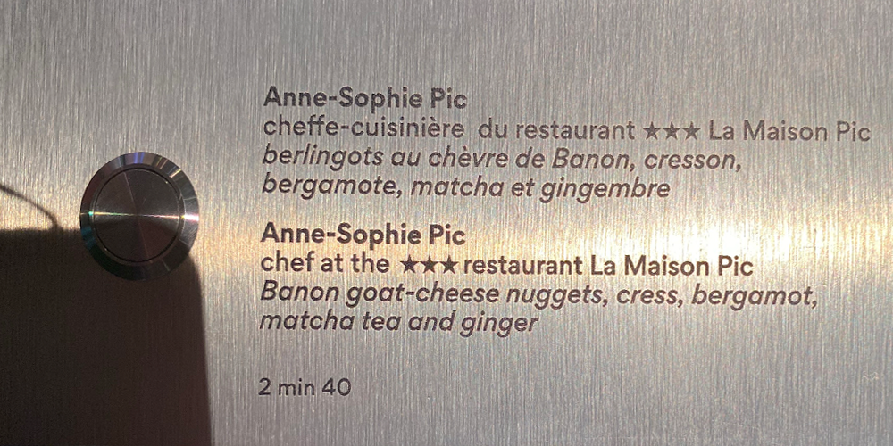

 - Les audios liés à chaque dessert.

    - [Audio du dessert de Sébastien Bras](https://youtu.be/IhVuG9N1TSc)
      > Vidéo par Sara Pop

  - Les vidéos qui sont diffusées sur le petit écran

  - Le contenu pour la plaquette d'explication

#### Composantes fournies par l'espace d'exposition (Centre des Sciences) ####

- La table
- Lieu où brancher...
  - Les fils audio (HDMI ou équivalent)
  - Les fils pour l'écran de diffusion (HDMI ou équivalent)
  - L'écran
  - Les panneaux de lumière bleue et orange qui entourent la table
  - Les haut-parleurs
    -  
  - Des icônes pour assurer que le dispositif ne soit pas endommagé
     - 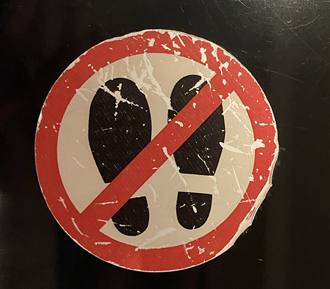

 ## Mes opinions ##

 J'ai choisi de documenter Les Plats Signatures pour une raison bien précise: dès mon arrivée devant l'installation, j'ai été immédiatement **captivé**. La combinaison des cloches en métal et en verre, les couleurs vives des desserts et les panneaux lumineux offraient une esthétique particulièrement attrayante. Par contre, je ne savais pas où regarder en premier ni quoi faire.  La disposition des éléments m'a semblé déroutante: l'écran se trouvait à **l'opposé** de la plaquette d'information et des boutons audio, alors que la vidéo diffusée concernait les faux desserts et **non** les cloches en métal. Je noterais aussi que les audios étaient plutôt longs, et je n'arrive pas à imaginer un jeune enfant rester devant un haut-parleur pendant plus de quelques secondes. Je mentionne les enfants, car *Le Banquet* est présenté comme une expérience adaptée à tous les âges. De plus, la salle était vaste et remplie de visiteurs, ce qui faisait que les sons se dispersaient beaucoup. À cause du bruit ambiant, l’audio des haut-parleurs était faible et parfois **incompréhensible**. Mettre des casques d'écoute à la disposition des visiteurs aurait été une solution efficace pour améliorer l’expérience sonore.

 Malgré ces quelques ajustements nécessaires, j’ai pris plaisir à explorer ce dispositif et à interagir avec ses éléments. J'apprécie désormais davantage l’art culinaire et l’importance de l’esthétique dans la gastronomie.
 

   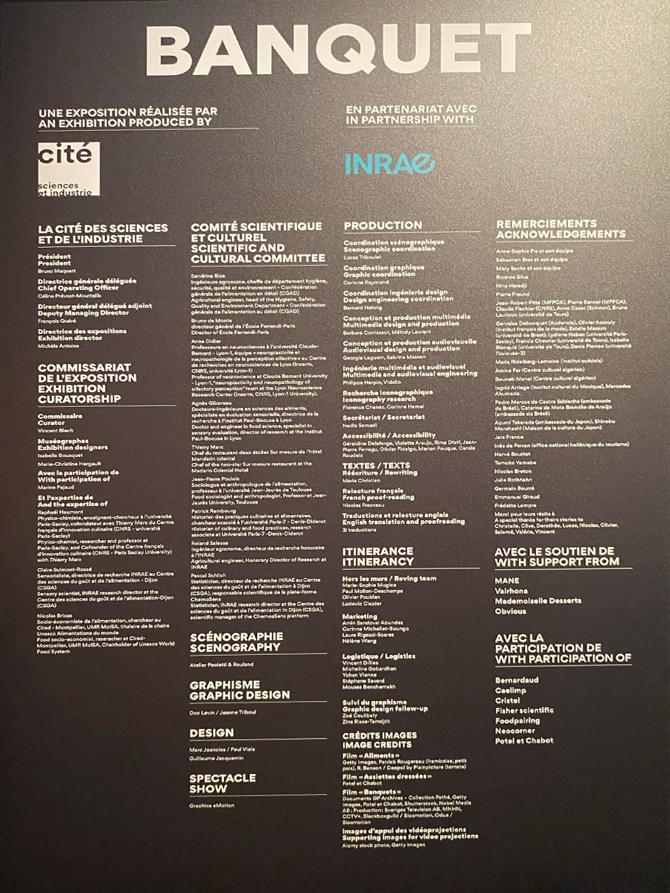
    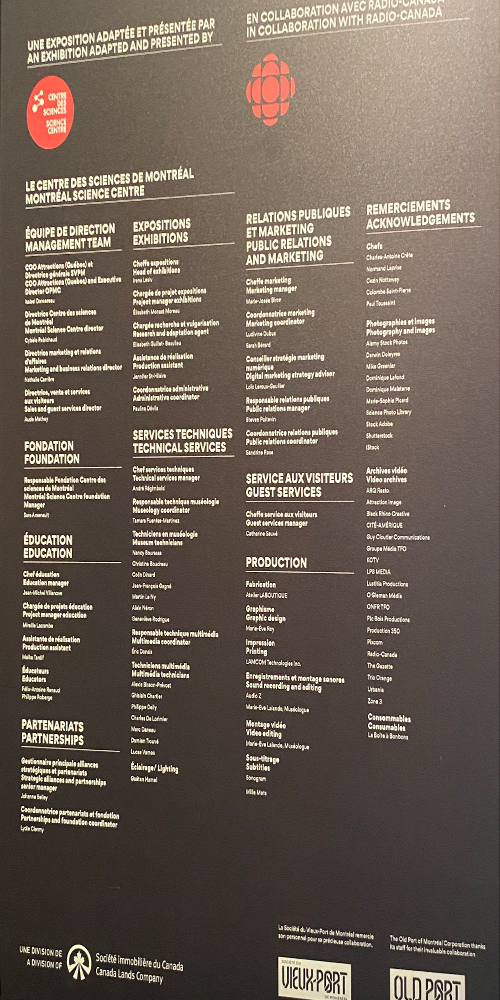

                                  

