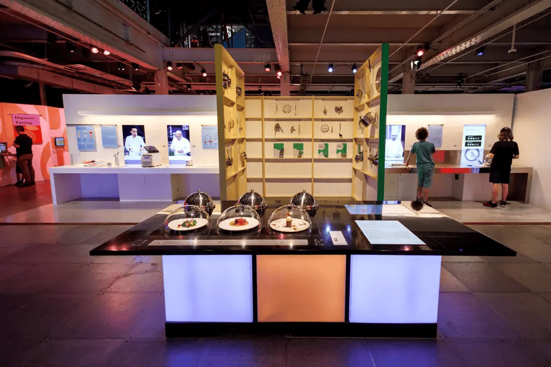
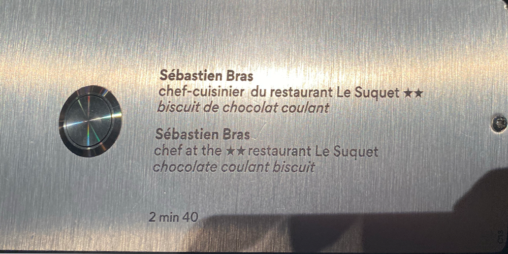
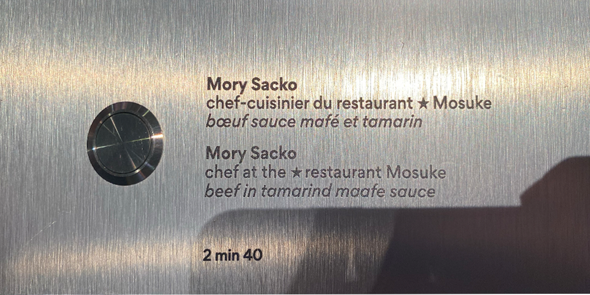
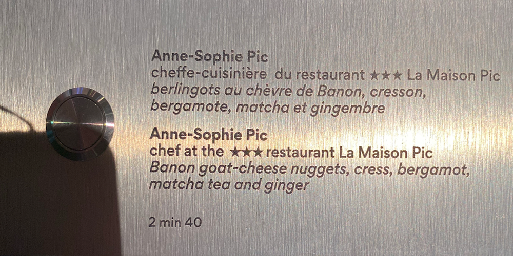
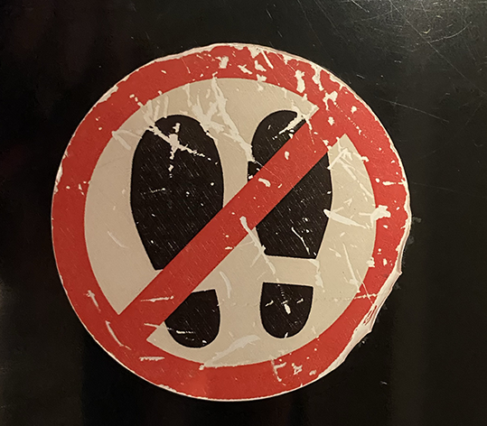

# Le Banquet

 
> **Photo par Sara Pop**  
> *Embarquez pour une expérience multisensorielle et interactive autour d'un thème que tout le monde aime : la nourriture!
Voyagez à travers 5 scénarios audacieux et interactifs!
En commençant par la cuisine et en passant par la salle à manger, vous travaillerez la pâte, essayerez des combinaisons de goûts originales et explorerez les saveurs et les arômes.* https://banquetexhibition.com/

## **Les Plats Signatures**
 
[vidéo d'ensmble](https://youtu.be/jK2MxHlzELg)

> **Photo et vidéo par Sara Pop**  

*Par Cité des sciences et des l'industrie en partenariat avec Inrae.*  

Ce dispositif interactif porte sur l'importance de l'apparence d'un plat. Ces mets peuvent êtres des mets plûtot banales, mais lorsqu'un artiste ajoute sa propre touche personelle créative, le met devient associé à eux. 
Le dispositif est composé d'une table blanche, ornée de trois desserts sculpté en acrylique qui sont abrité par un couvercle en verre ainsi que trois autres couvercles en métal qui s'ouvrent du coté opposé de la table . Sur la table, il y a également deux boutons qui permettent de commencer l'expérience interactive. Après avoir appuyé ce bouton,
il est possible d'ensuite appuyer sur les prochains boutons, situés en dessous de chaque faux dessert. Ces boutons enclenchent des audios qui expliquent chaque étape du dessert. Sous ces derniers, il y a une plaquette qui donne crédit au chef-cuisinier qui a composé le dessert, ainsi que les composantes de la friandise. Sous les plats metalliques se retrouvent trois images d'oeuvres réalisés par divers artistes ainsi qu'un plat qui s'est inspiré de ces oeuvres. De plus, il y a un petit écran qui diffuse des vidéos des chefs-cuisiniers qui composent leur oeuvre.

 
> **Photo par Sara Pop**  

Voici un comment intéragir avec les dispositif:
1. https://youtube.com/shorts/S1N97JyBPeM?feature=share 
2. https://youtube.com/shorts/qJVBQXrtq_E?feature=share
   > **Vidéos par Pablo Pereira Calderon**

## Mise en espace ##

> **Photo par Alain Roberge, la Presse. https://www.lapresse.ca/gourmand/centre-des-sciences/gastronomie-science-et-plaisir/2024-06-30/banquet/interactivite-au-menu.php**

### Composantes et techniques ###
 #### Composantes fournis par l'artiste ####
 
-  Les faux desserts assemblés.
    - 
      > Par [Sebastien Bras](https://www.bras.fr/fr/la-cuisine/sebastien-bras)
    - 
     > Par [Mory Sacko](https://mory-sacko.com/chef/)
    - 
     > Par [Anne-Sophie Pic](https://anne-sophie-pic.com/portrait/)

     
- Les plaquettes gravés.
  
  - 
  
  - 
  
  - 

 - Les audios liés à chaque dessert.

    - [Audio du dessert de Sébastien Bras](https://youtu.be/IhVuG9N1TSc)
      > Vidéo par Sara Pop

  - Les vidéos qui sont diffusés sur le petit écran

  - Le contenu pour la plaquette d'explication

#### Composantes fournis par l'espace d'exposition (Centre des Sciences) ####

- La table
- Lieu oû brancher...
  - Les fils audio (HDMI ou équivalent)
  - Les fils pour l'écran de diffusion (HDMI ou équivalent)
  - L'écran
  - Les panneaux de lumière bleu et orange qui sont autour de la table
  - Les hauts-parleurs
    -  
  - Des icônes pour assurer que le dispositif ne soit pas endommagé
     - 
 

  

                                  

