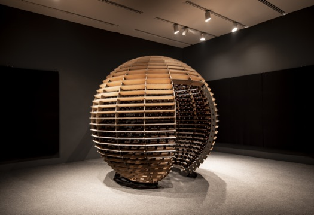

# La touche de Rafael Lozano-Hemmer

## Compte rendu de la présentation de Jade Séguéla

### Résumé
Le 25 mars, nous avons eu la chance de rencontrer Jade Séguéla. Jade travaille pour Rafael Lozano-Hemmer, un grand artiste multimédia.
Elle est registraire, c'est-à-dire qu'elle s'occupe d'envoyer les œuvres de Rafael, communique avec les acheteurs à l'international,
connaît chaque composante et emplacement de chaque œuvre, et est même envoyée elle-même pour monter les installations. Elle nous a fait
part de son rôle, mais aussi du processus créatif de Rafael.

### Rafael Lozano-Hemmer

Rafael est un artiste mexicain connu à l'international, qui crée des œuvres numériques. Il s'intéresse à la psychologie derrière l'art
et à l'effet qu'une pièce peut avoir sur le spectateur. Il essaye de susciter toutes sortes d'émotions chez son public, même des sentiments
de fatigue, voire d'accablement. Il préfère l'interactivité passive, c'est-à-dire que le spectateur n'a même pas besoin d'interagir avec l'œuvre
pour qu'elle soit immersive. 

### Son processus

Jade nous a partagé tout le processus derrière une des plus grande oeuvres de Rafael : **Sphere packing: Bach.**

###### *Photo par Mariana Yañez.*

Voici les étapes :

1. Concept                           <----------|
2. Planification                                |
3. Production                                   |   Rafael Lozano-Hemmer
4. Création de l'oeuvre              <----------|
5. Opportunités d'exposition         <-----------|
6. Entreposage jusqu'a l'exposition              |
7. Transport                                     |  Jade Séguéla
8. Installation                                  |
9. Exposition                                    |
10. Désinstallation                   <----------|

C'est un long processus qui est compliqué selon Jade, puisque les œuvres sont grandes, avec beaucoup de composantes. Les démonter,
les faire voyager, puis devoir les assembler de nouveau est difficile et demandant. Chaque composante a sa propre boîte et doit être entreposée d'une manière spécifique afin de rester intacte. La sphère de Bach est l'œuvre la plus compliquée dont elle s'est occupée, notamment à cause de ses nombreuses composantes.

Elle est composé de :
- 1158 hauts-parleurs
- 11km de cables
- Une sphère qui fait 3m de diamètre et qui pèse 600 kg

### Conclusion

J'ai trouvé la conférence intéressante. Jade nous a partagé une partie de l'industrie dont on ne parle pas beaucoup. La majorité du temps, l'attention
est mise sur l'artiste lui-même et son œuvre, mais on ne parle pas du travail et de l'organisation des assistants de l’artiste.
Elle connaissait en effet très bien chaque composante et processus des œuvres présentées, et j'ai trouvé ça plutôt fascinant.
